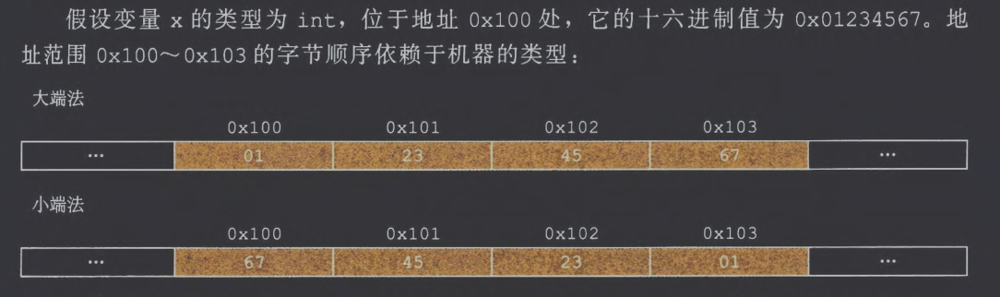

# 1. 信息存储
## (1) 十六进制表示法
## (2) 字数据大小

对于一个字长为 $w$ 位的机器，虚拟地址的范围是 $0$ ~ $2^w-1$ ，程序最多访问 $2^w$ 个字节

| 有符号           | 无符号            | 32位 | 64位 |
| ------------- | -------------- | --- | --- |
| [signed] char | unsigned char  | 1   | 1   |
| short         | unsigned short | 2   | 2   |
| int           | unsigned       | 4   | 4   |
| long          | unsigned long  | 4   | 8   |
| int32_t       | uint32_t       | 4   | 4   |
| int64_t       | uint64_t       | 8   | 8   |
| char*         |                | 4   | 8   |
| float         |                | 4   | 4   |
| double        |                | 8   | 8   |
## (3) 寻址和字节顺序

## (4) 表示字符串

C 语言中字符串被编码为一个以 null (其值为 0) 字符结尾的字符数组，每个字符都由某个标准编码来表示，最常见的是 ASCII 字符码
## (5) 表示代码
## (6) 布尔代数简介
## (7) C语言中的位级运算
## (8) C语言中的逻辑运算
## (9) C语言中的移位运算

| 移位类型/语言规则    | 填充方式   | 含义/备注            |
| ------------ | ------ | ---------------- |
| x << k（左移）   | 右边补 0  | 相当于 × 2^k        |
| x >> k（逻辑右移） | 左边补 0  | 相当于无符号除以 2^k     |
| x >> k（算术右移） | 左边补符号位 | 保留符号，类似带符号除以 2^k |
# 2. 整数表示
## (1) 整数数据类型
## (2) 无符号数的编码
## (3) 补码编码

补码规定：最高位权重为 $-2^{w-1}$， 其余位权重为 $+2^i$
## (4) 有符号数和无符号数之间的转换
## (5) C 语言中的有符号数与无符号数
## (6) 拓展一个数字的位表示
## (7) 截断数字

截断补码需要将最高位转换为符号位
## (8) 关于有符号数和无符号数的建议
# 3. 整数运算
## (1) 无符号加法

对于满足 $0 ≤ x, y < 2^w$ 的 $x$ 和 $y$ 有：

$$
x \,+^{u}_w\, y =
\begin{cases}
x + y, & x + y < 2^w \quad \text{（正常）} \\
x + y - 2^w, & 2^w \le x + y < 2^{w+1} \quad \text{（溢出）}
\end{cases}
$$
## (2) 补码加法

对于满足 $-2^{w-1} \le x, y\le 2^{w-1}-1$ 的整数 $x$ 和 $y$ 有：

$$
x +^{t}_w y =
\begin{cases}
x + y - 2^w, & 2^{\,w-1} \le x + y \qquad\;\; \text{（正溢出）} \\[6pt]
x + y,       & -2^{\,w-1} \le x + y < 2^{\,w-1} \quad \text{（正常）} \\[6pt]
x + y + 2^w, & x + y < -2^{\,w-1} \qquad\;\; \text{（负溢出）}
\end{cases}
$$
## (3) 补码的非
## (4) 无符号乘法

$$
x \times^{u}_w y =
\begin{cases}
xy, & 0 \le xy < 2^w \qquad\qquad\text{（无溢出）} \\[6pt]
xy - 2^w, & 2^w \le xy < 2^{w+1} \quad\;\;\text{（溢出，取低 $w$ 位）} \\[6pt]
\vdots \\[-2pt]
xy \bmod 2^w, & 0 \le xy < 2^{2w} \qquad\text{（一般情况）}
\end{cases}
$$
## (5) 补码乘法

$$
x \times^{t}_w y =
\begin{cases}
xy - 2^w, & xy \ge 2^{\,w-1} \qquad\qquad\;\;\text{（正溢出）} \\[6pt]
xy,       & -2^{\,w-1} \le xy < 2^{\,w-1} \quad\text{（正常）} \\[6pt]
xy + 2^w, & xy < -2^{\,w-1} \qquad\qquad\;\;\text{（负溢出）}
\end{cases}
$$
## (6) 乘以常数
## (7) 除以2的幂
## (8) 关千整数运算的最后思考
# 4. 浮点数
## (1) 二进制小数
## (2) IEEE浮点表示

$$(-1)^{sign} × (1.fraction) × 2^{exponent-bias}$$

| 类型          | 总位数 | sign | exponent | fraction | bias |
| ----------- | --- | ---- | -------- | -------- | ---- |
| float（单精度）  | 32  | 1    | 8        | 23       | 127  |
| double（双精度） | 64  | 1    | 11       | 52       | 1023 |
极端情况：

| exponent | fraction | 表示    |
| -------- | -------- | ----- |
| 非全0，非全1  | 任意       | 规格化数  |
| 全0       | 任意非0     | 非规格化数 |
| 全0       | 0        | ±0    |
| 全1       | 0        | ±∞    |
| 全1       | 非0       | NaN   |
## (3) 数字示例
## (4) 舍入
## (5) 浮点运算
## (6) C语言中的浮点数
# 5. 小结

由于我学习CSAPP这门课的顺序是先听了CMU的课程，然后再回来重新阅读教材并做了笔记，所以我对这本书的阅读不是按照章节顺序进行的。这章是我阅读这本书的倒数第2章，同时我上学期也学习完了NJU的DLCO这门课，因此这章的非常多的内容我都没有记录到笔记中，就简单记录了一些我之后可能需要回来查阅的内容。