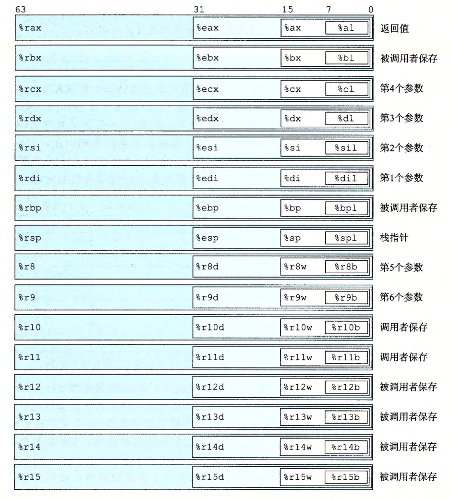

# 1. 历史观点
# 2. 程序编码
```shell
linux> gcc -Og -o p p1.c p2.c 
```
- `gcc`表明采用GCC C编译器。
- `-Og`标识编译器采用简单优化，但仍保持原码与机器码的对应关系。

编译器工作流程
1. 调用C语言预处理器拓展原代码，插入所有用`#include`命令指定的文件，并拓展所有用`#define`声明指定的宏。
2. 编译器产生两个源文件的汇编代码，分别为`p1.s`和`p2.s`。
3. 汇编器讲汇编代码转换成二进制目标代码文件`p1.o`和`p2.o`。需要注意的是，这里并没有填入全局值的地址，比如调用库函数的起点虚拟地址，或者是声明的全局变量等。
4. 最后链接器将两个目标代码文件与实现库函数（例如`printf`）的代码合并，产生最终的可执行代码文件`p`。
## (1) 机器级代码

- 机器代码对C语言隐藏的处理器状态：
	1. 程序计数器（PC，在`x86-64`中用`%rip`表示）给出将要执行的下一条指令地址。
	2. `x86-64`共有16个整数寄存器，每个寄存器64位，用于存储局部变量、函数返回值等信息。包括`rax, rbx, rcx, rdx, rsp, rbp, rsi, rdi, r8~r15`。
	3. 条件码寄存器储存状态信息，实现控制或数据流中的条件变化。
	4. 存在向量寄存器可以存放一个或多个整数或浮点数值。

- 在程序运行的过程中，只有有限的一部分虚拟地址被认为是合法的。这是因为操作系统为程序映射了实际需要的内存区域，并通过虚拟内存以及页表机制限制了访问，从而保证进程间的隔离。
## (2) 代码示例

```C
//mstore.c
long mult2(long, long);

void multstore(long x, long y, long *dest) 
{
	long t = mult2(x, y);
	*dest = t;
}
```
 此时通过指令`gcc -Og -S mstore.c`可以生成文件`mstore.s`但并不做任何工作，此时可以看到`mstore.s`的内容：
 ```shell
 multstore:
.LFB0:
	.cfi_startproc
	endbr64
	pushq	%rbx
	.cfi_def_cfa_offset 16
	.cfi_offset 3, -16
	movq	%rdx, %rbx
	call	mult2@PLT
	movq	%rax, (%rbx)
	popq	%rbx
	.cfi_def_cfa_offset 8
	ret
	.cfi_endproc
.LFE0:
 ```
 这里核心代码是与书上完全一致的，多出来的部分是新版本的`gcc`默认添加了许多调试、安全特性。这时可以通过指令`gcc -Og -c mstore.c`生成二进制格式的目标代码文件`mstore.o`。

如果想要查看机器代码的内容，可以使用反汇编的技术，例如输入指令`objdump -d mstore.o`会产生如下结果：
```shell
mstore.o:     file format elf64-x86-64

Disassembly of section .text:

0000000000000000 <multstore>:
   0:   f3 0f 1e fa             endbr64
   4:   53                          push   %rbx
   5:   48 89 d3                mov    %rdx,%rbx
   8:   e8 00 00 00 00      call   d <multstore+0xd>
   d:   48 89 03                mov    %rax,(%rbx)
  10:   5b                          pop    %rbx
  11:   c3                           ret
```
这里与教材的结果不完全一致仍然是因为`gcc`默认进行了一些优化。由于汇编指令长度不固定，所以对应的机器码长度也不同。根据指令集规则，CPU可以唯一确定某字节代表哪条汇编语句。

利用反汇编生成的汇编代码和`gcc`生成的代码不会完全相同，`gcc`生成的汇编会严格加上大小后缀（`movq`，`addl`），而反汇编则没有。
```C
//main.c
#include <stdio.h>
void multstore(long, long, long*);
int main() {
	long d;
	multstore(2, 3, &d);
	printf("2 * 3 --> %1d\n", d);
	return 0;
}
long mult2(long a, long b) {
	long s= a* b;
	return s;
}
```
添加`main.c`后可通过`gcc -Og -o prog main.c mstore.c`来生成可执行文件`prog`。并使用`objdump -d prog`来实现反汇编。
## (3) 关于格式的注解
# 3. 数据格式
|C 声明|Intel 数据类型|汇编代码后缀|大小(字节)|
|---|---|---|---|
|char|字节|b|1|
|short|字|w|2|
|int|双字|l|4|
|long|四字|q|8|
|char*|四字|q|8|
|float|单精度|s|4|
|double|双精度|l|8|
- 在64位机器中，指针长8字节。
# 4. 访问信息


## (1) 操作数指示符
数据读取
1. 立即数：书写方式是'`$`'后面跟一个整数。
2. 寄存器：表示某个寄存器内存储的内容，用符号$r_a$表示寄存器$a$，用$R[r_a]$ 表示它存储的值。
3. 内存引用：根据计算出来的有效地址访问某个内存位置，用符号$M_b[Addr]$表示对存储在内存中从地址$Addr$开始的$b$个字节。通常省略下标$b$。

寻址方式
- 通用形式为$Imm(r_b, r_i, s)$。
- $Imm$为立即数偏移，$r_b$为基址寄存器，$r_i$为变址寄存器，$s$为变址因子。$s$只能从$1,2,4,8$中选择。
- 有效地址被计算为$Imm+R[r_b]+R[r_i]\cdot s$。
- 其他形式见下表，均为该通用形式的特殊表示

| 格式                 | 操作数值                              | 名称       |
| ------------------ | --------------------------------- | -------- |
| $\$Imm$            | $Imm$                             | 立即数寻址    |
| $r_a$              | $R[r_a]$                          | 寄存器寻址    |
| $Imm$              | $M[Imm]$                          | 绝对寻址     |
| $(r_a)$            | $M[R[r_a]]$                       | 间接寻址     |
| $Imm(r_a)$         | $M[Imm + R[r_a]]$                 | 基址+偏移量寻址 |
| $(r_b, r_i)$       | $M[R[r_b] + R[r_i]]$              | 变址寻址     |
| $Imm(r_b, r_i)$    | $M[Imm + R[r_b] + R[r_i]]$        | 变址寻址     |
| $(, r_i, s)$       | $M[R[r_i] \cdot s]$               | 比例变址寻址   |
| $Imm(, r_i, s)$    | $M[Imm + R[r_i] \cdot s]$         | 比例变址寻址   |
| $(r_b, r_i, s)$    | $M[R[r_b] + R[r_i] \cdot  s]$     | 比例变址寻址   |
| $Imm(r_b, r_i, s)$ | $M[Imm+ R[r_b] + R[r_i] \cdot s]$ | 比例变址寻址   |
## (2) 数据传送指令
`MOV S, D`的作用是将`S`中的数据传送到`D`中，以下是示例：
```shell
movl $0x4050,%eax                        Immediate--Register, 4 bytes
movw %bp,%sp                                 Register--Register,    2 bytes
movb (%rdi,%rcx),%al                      Memory一Register,     1 byte
movb $-17, (%rsp)                           Immediate--Memory,  1 byte
movq %rax,-12(%rbp)                       Register--Memory,     8 bytes
```
## (3) 数据传送示例
考虑如下代码
```C
long exchange(long *xp, long y)
{
	long x = *xp;
	*xp = y;
	return x;
}
```
汇编代码为
```ass
//xp in %rdi, y in %rsi
00000000000011ea <exchange>:
    11ea:       f3 0f 1e fa             endbr64
    11ee:       48 8b 07                mov    (%rdi),%rax
    11f1:       48 89 37                mov    %rsi,(%rdi)
    11f4:       c3                          ret
```
## (4) 压入和弹出栈数据
- 栈指针`%rsp`用于保存栈顶元素的地址

| 指令        | 效果                                       | 描述     |
| --------- | ---------------------------------------- | ------ |
| `pushq S` | R[%rsp] ← R[%rsp] − 8;<br>M[R[%rsp]] ← S | 将四字压入栈 |
| `popq D`  | D ← M[R[%rsp]];<br>R[%rsp] ← R[%rsp] + 8 | 将四字弹出栈 |
# 5. 算术和逻辑操作
| 指令   | 操作数 | 效果        | 描述               |
|--------|--------|-------------|--------------------|
| leaq   | S, D   | D ← &S      | 加载有效地址       |
| INC    | D      | D ← D + 1   | 加 1              |
| DEC    | D      | D ← D - 1   | 减 1              |
| NEG    | D      | D ← -D      | 取负              |
| NOT    | D      | D ← ~D      | 取补              |
| ADD    | S, D   | D ← D + S   | 加                |
| SUB    | S, D   | D ← D - S   | 减                |
| IMUL   | S, D   | D ← D * S   | 乘                |
| XOR    | S, D   | D ← D ^ S   | 异或              |
| OR     | S, D   | D ← D \| S  | 或                |
| AND    | S, D   | D ← D & S   | 与                |
| SAL    | k, D   | D ← D << k  | 左移              |
| SHL    | k, D   | D ← D << k  | 左移（等同于 SAL） |
| SAR    | k, D   | D ← D >> k  | 算术右移（保符号） |
| SHR    | k, D   | D ← D >> k  | 逻辑右移（补 0）  |

- 加载有效地址

```C
long scale(long x, long y, long z)
{
    long t = x +4*y +12* z;
    return t;
}
```
汇编代码如下：
```asm
00000000000011f5 <scale>:
    11f5:       f3 0f 1e fa               endbr64
    11f9:       48 8d 04 b7             lea    (%rdi,%rsi,4),%rax       x + 4*y
    11fd:       48 8d 14 52              lea    (%rdx,%rdx,2),%rdx    z + 2*z = 3*z
    1201:       48 8d 04 90             lea    (%rax,%rdx,4),%rax    
    1205:       c3                            ret
```

- 特殊的算术操作

| 指令        | 效果 (寄存器变化)                                                           | 描述                                          |
| --------- | -------------------------------------------------------------------- | ------------------------------------------- |
| `imulq S` | `R[%rdx]:R[%rax] ← S × R[%rax]`                                      | **有符号**乘法，全宽结果存放在 `%rdx:%rax`               |
| `mulq S`  | `R[%rdx]:R[%rax] ← S × R[%rax]`                                      | **无符号**乘法，全宽结果存放在 `%rdx:%rax`               |
| `cqto`    | `R[%rdx]:R[%rax] ← sign-extend(R[%rax])`                             | 把 `%rax` 符号扩展成 128 位，写入 `%rdx:%rax`（除法前置操作） |
| `idivq S` | `R[%rax]←(R[%rdx]:R[%rax]) mod S`<br>`R[%rdx]←(R[%rdx]:R[%rax]) ÷ S` | **有符号**除法，商在 `%rax`，余数在 `%rdx`              |
| `divq S`  | `R[%rax]←(R[%rdx]:R[%rax]) mod S`<br>`R[%rdx]←(R[%rdx]:R[%rax]) ÷ S` | **无符号**除法，商在 `%rax`，余数在 `%rdx`              |

对于代码
```C
#include <inttypes.h>
typedef unsigned __int128 uint128_t;

void store_uprod(uint128_t *dest, uint64_t x, uint64_t y)
{
    *dest = x * (uint128_t)y;
}
```
生成的汇编语句如下,除法语句也类似
```shell
00000000000011d8 <store_uprod>:
    11d8:       f3 0f 1e fa             endbr64
    11dc:       48 89 f0                 mov    %rsi,%rax
    11df:       48 f7 e2                 mul    %rdx
    11e2:       48 89 07                mov    %rax,(%rdi)
    11e5:       48 89 57 08           mov    %rdx,0x8(%rdi) 
      #store upper 8 bytes at dest+8
    11e9:       c3                           ret
```
# 6. 控制
## (1) 条件码

常用条件码：
1. `CF`：进位标志，操作使最高位产生了进位。
2. `ZF`：零标志。
3. `SF`：符号标志，操作得到负数。
4. `OF`：溢出标志，操作导致补码溢出。

对于`t = a + b`，根据以下表达式设置条件码：
- `CF = (unsigned)t < (unsigned)a`
- `ZF = (t == 0)`
- `SF = (t < 0)`
- `OF = ((a < 0) == (b < 0)) && ((t < 0) != (a < 0))`

指令`CMP S1. S2`的结果基于`S2-S1`，`TEST S1, S2`基于`S1&S2`，只设置条件码，不改变任何寄存器的值。
## (2) 访问条件码

`SET`指令会根据某些条件码的某种组合，将某字节设置为0或1。`SET`指令的后缀表示不同的条件，而不是操作数的大小。下表是一个计算`long`类型的C语言表达式`a < b`的指令序列：

| 指令        | 效果                                  | 含义（中文）       |
| --------- | ----------------------------------- | ------------ |
| `sete D`  | $D\leftarrow ZF$                    | 相等 / 零       |
| `setne D` | $D\leftarrow -ZF$                   | 不等 / 非零      |
| `sets D`  | $D\leftarrow SF$                    | 负数           |
| `setns D` | $D\leftarrow -SF$                   | 非负数          |
| `setg D`  | $D\leftarrow -(SF\oplus OF)\& -ZF$  | 大于（有符号 >）    |
| `setge D` | $D\leftarrow -(SF\oplus OF)$        | 大于等于（有符号 ≥）  |
| `setl D`  | $D\leftarrow SF\oplus OF$           | 小于（有符号 <）    |
| `setle D` | $D\leftarrow (SF\oplus OF) \lor ZF$ | 小于等于（有符号 ≤）  |
| `seta D`  | $D\leftarrow -CF \& -ZF$            | 超过（无符号 >）    |
| `setae D` | $D\leftarrow -CF$                   | 超过或相等（无符号 ≥） |
| `setb D`  | $D\leftarrow CF$                    | 低于（无符号 <）    |
| `setbe D` | $D \leftarrow CF\lor ZF$            | 低于或相等（无符号 ≤） |

具体使用如下：
```shell
#int comp(data_t a, data_t b)
#a in %rdi, b in %rsi
1 comp: 
2    cmpq %rsi, %rdi              #compare a:b
3    setl %al                           #Set low-order byte of %eax to 0 or 1
4    movzbl %al, %eax            #Clear rest of %eax(and rest of %rax)
5    ret
```
## (3) 跳转指令

```shell
	movq $0, %rax            #Set %rax to 0
	jmp .L1                        #Goto L1
	movq (%rax), %rdx     #Null pointer dereference(skipped)
.L1:
	popq %rdx                  #Jump target
```
这里的`movq (%rax), %rdx`永远不会被执行到。

跳转目的地址的读取：
1. `jmp *%rax`：指令用寄存器`%rax`中的值作为跳转目标。
2. `jmp *(%rax)`：指令以`%rax`中的值作为读地址，从内存中读出该跳转目标。

| 指令           | 同义名  | 跳转条件             | 描述            |
| ------------ | ---- | ---------------- | ------------- |
| jmp Label    |      | 1                | 直接跳转          |
| jmp *Operand |      | 1                | 间接跳转          |
| je Label     | jz   | ZF               | 相等/零          |
| jne Label    | jnz  | ~ZF              | 不相等/非零        |
| js Label     |      | SF               | 负数            |
| jns Label    |      | ~SF              | 非负数           |
| jg Label     | jnle | ~(SF ^ OF) & ~ZF | 大于 (有符号>)     |
| jge Label    | jnl  | ~(SF ^ OF)       | 大于或等于 (有符号>=) |
| jl Label     | jnge | SF ^ OF          | 小于 (有符号<)     |
| jle Label    | jng  | (SF ^ OF) \| ZF  | 小于或等于 (有符号<=) |
| ja Label     | jnbe | ~CF & ~ZF        | 超过 (无符号>)     |
| jae Label    | jnb  | ~CF              | 超过或相等 (无符号>=) |
| jb Label     | jnae | CF               | 低于 (无符号<)     |
| jbe Label    | jna  | CF \| ZF         | 低于或相等 (无符号<=) |
## (4) 跳转指令的编码

原始汇编代码
```shell
1      movq   %rdi, %rax
2      jmp    .L2
3 .L3:
4      sarq   %rax
5 .L2:
6      testq  %rax, %rax
7      jg     .L3
8  rep; ret
```
反汇编产生的代码
```shell
 0: 48 89 f8             mov   %rdi,%rax
 3: eb 03                  jmp   8 <loop+0x8>
 5: 48 d1 f8              sar   %rax
 8: 48 85 c0             test  %rax,%rax
 b: 7f f5                   jg    5 <loop+0x5>
 d: f3 c3                  repz retq
```
1. `0x3: eb 03`
    - `eb` 表示短跳 (short jump)，操作数是 1 字节带符号偏移量。
    - `03` 就是+3。
    - 规则：目标地址 = 下一条指令地址 + 偏移量。
    - 下一条指令地址 = `0x5`（`sar` 的位置）。
    - 所以：目标地址 = `0x5 + 3 = 0x8`，跳到 `test` 指令。
2. `0xb: 7f f8`
    - `7f` 表示`jg`，后面操作数`f8`是1字节带符号偏移。
    - `f8`是补码表示，十进制是`-8`。
    - 下一条指令地址 = `0xd`（`ret`的位置）。
    - 所以：目标地址 = `0xd + (-8) = 0x5`，跳回`sar`。
## (5) 用条件控制来实现条件分支

Ex.将如下汇编代码转换成C语言代码
```shell
#long test (long x, long y, long z)
# x in %rdi, y in %rsi , z in %rdx
test:
    leaq    (%rdi,%rsi), %rax  
    addq    %rdx, %rax   
    cmpq    $-3, %rdi        
    jge     .L2                 
    cmpq    %rdx, %rsi         
    jge     .L3
    movq    %rdi, %rax          
    imulq   %rsi, %rax
    ret
.L3:                            
    movq    %rsi, %rax
    imulq   %rdx, %rax
    ret
.L2:
    cmpq    $2, %rdi            
    jle     .L4
    movq    %rdi, %rax         
    imulq   %rdx, %rax
    ret
.L4:                            
    ret
```

```C
long test(long x, long y, long z)
{
	long val= x + y + z ;
	if (x < -3) {
		if (y < z)
			val= x * y;
		else
			val= y * z;
	} 
	else if (x > 2)
		val= x * z;
	return val;
}
```
## (6) 用条件传送来实现条件分支

- 由于现代CPU采用流水线设计，当程序需要分支预测时，预测错误会造成相当严重的惩罚，即使程序性能下降。而使用条件传送技术可以有效缓解这种惩罚，使控制流不依赖于数据，控制器更容易使流水线是满的。
- 下表是常用的条件传送指令，当传送条件满足时，指令将原值S复制到目的R。

| 指令     | 同义名   | 描述                       |
|----------|----------|----------------------------|
| `cmove`  | `cmovz`  | 相等/零                    |
| `cmovne` | `cmovnz` | 不相等/非零                |
| `cmovs`  |          | 负数                       |
| `cmovns` |          | 非负数                     |
| `cmovg`  | `cmovnle`| 大于（有符号 >）           |
| `cmovge` | `cmovnl` | 大于或等于（有符号 >=）    |
| `cmovl`  | `cmovnge`| 小于（有符号 <）           |
| `cmovle` | `cmovng` | 小于或等于（有符号 <=）    |
| `cmova`  | `cmovnbe`| 超过（无符号 >）           |
| `cmovae` | `cmovnb` | 超过或相等（无符号 >=）    |
| `cmovb`  | `cmovnae`| 低于（无符号 <）           |
| `cmovbe` | `cmovna` | 低于或相等（无符号 <=）    |
```C
long absdiff(long x, long y)
{
    long result;
    if(x < y)
        result = y -x;
    else
        result = x - y;
    return result;
}
```
这段代码在`-Og`的优化级别下仍然是条件控制，当优化级别`-O1`及以上的时候会编译成下面的形式：
```shell
0000000000000035 <absdiff>:
  35:   f3 0f 1e fa             endbr64
  39:   48 89 f2                mov    %rsi,%rdx
  3c:   48 29 fa                 sub    %rdi,%rdx
  3f:   48 89 f8                 mov    %rdi,%rax
  42:   48 29 f0                sub    %rsi,%rax
  45:   48 39 f7                cmp    %rsi,%rdi
  48:   48 0f 4c c2            cmovl  %rdx,%rax
  4c:   c3                           ret
```

>需要注意的是，不是所有的情况都可以使用条件传送，因为条件传送会对`then-expr`和`else-expr`两条表达式都求值。

```C
long cread(long *xp)
{
	return (xp ? *xp : 0);
}
```
这段C语言代码就不能采用条件传送来编译。
## (7) 循环

`while`循环
```C
long fact_do(long n)
{
    long result = 1;
    do {
        result*= n;
        n = n-1;
    } while (n > 1) ;
    return result;
}
```
汇编代码如下
```shell
0000000000000000 <fact_do>:
   0:   f3 0f 1e fa                 endbr64
   4:   b8 01 00 00 00          mov    $0x1,%eax
   9:   48 0f af c7                imul   %rdi,%rax
   d:   48 83 ef 01                sub    $0x1,%rdi
  11:   48 83 ff 01                cmp    $0x1,%rdi
  15:   7f f2                         jg     9 <fact_do+0x9>
  17:   c3                              ret
```

`for`循环的格式大致可以看作
```C
for(init-expr;test-expr;update-expr)
	body-statement;
```
与这种写法的`while`循环是完全等价的
```C
init-expr;
while(test-expr){
	body-statement;
	update-expr;
}
```
## (8) switch语句
