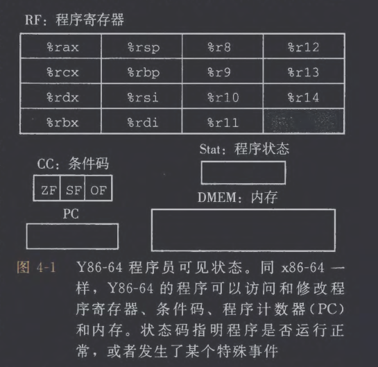
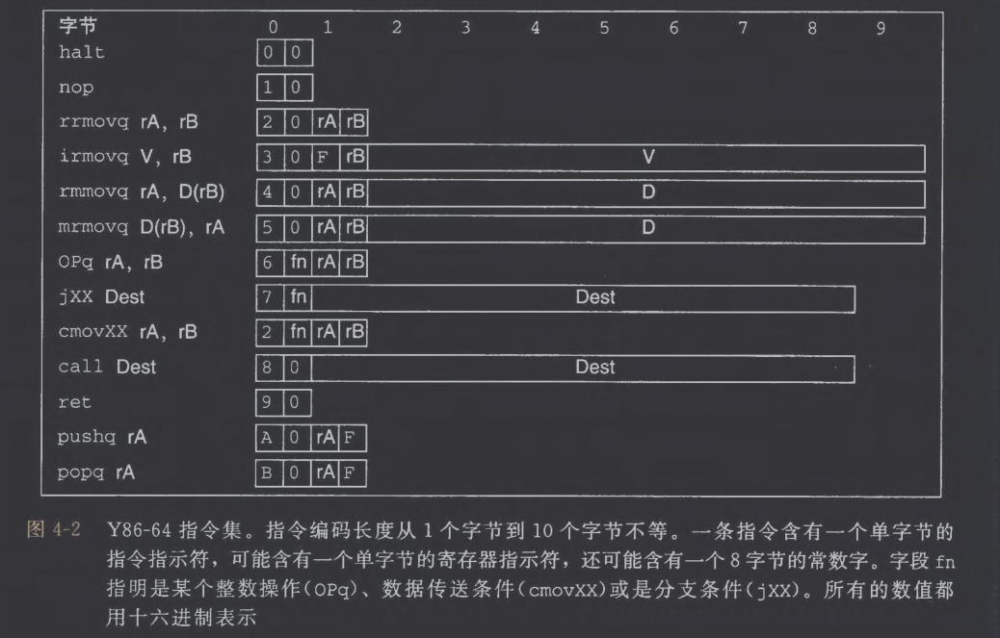
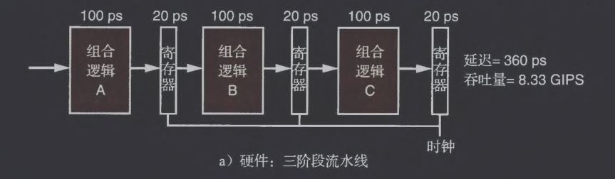

# 1. Y86-64指令集体系结构
## (1) 程序员可见的状态

定义一个指令集体系结构（例如上图的Y86-64）需要定义格中状态单元、指令集、一组编程规范和异常事件处理

Y86-64的每条指令都会读取或修改处理器状态的某些部分，这部分被称为程序员可见状态，包含上图中的寄存器、条件码、PC、Stat、内存
## (2) Y86-64指令

每条指令的第一个字节表明指令的类型，其中高4位为代码部部分，低4位为功能部分

## (3) 指令编码

| 部分   | 名称     | 作用         |
| ---- | ------ | ---------- |
| 第1字节 | 指令码    | 表示指令类型及功能  |
| 第2字节 | 寄存器指示符 | 指定寄存器      |
| 后续字节 | 常数字    | 存储立即数或地址偏移 |

示例：对于指令`rmmovq %rsp, 0x123456789abcd(%rdx)`

| 部分    | 内容                       | 字节序列                            |
| ----- | ------------------------ | ------------------------------- |
| 指令码   | rmmovq                   | `0x40`                          |
| 寄存器字节 | %rsp → rA=4, %rdx → rB=2 | `0x42`                          |
| 8字节偏移 | 0x000123456789abcd       | `cd ab 89 67 45 23 01 00`       |
| 最终机器码 |                          | `40 42 cd ab 89 67 45 23 01 00` |
## (4) Y86-64异常

| Stat | 名称  | 含义        | 对应行为                |
| ---- | --- | --------- | ------------------- |
| 1    | AOK | 正常运行      | 处理器继续执行下一条指令        |
| 2    | HLT | 执行到halt指令 | 程序正常终止，停止执行         |
| 3    | ADR | 地址异常      | 程序访问了非法内存地址（读或写时发生） |
| 4    | INS | 非法指令      | 程序中出现了无效的机器码        |
## (5) Y86-64程序

```C
long sum(long *start, long count) {
	long sum = 0;
	while (count) {
	    sum += *start;
	    start++;
	    count--;
	  }
	  return sum;
}
```

```asm
sum:
  irmovq $8, %r8      # 每次前进 8 字节（一个 long 的大小）
  irmovq $1, %r9      # 用于 count--
  xorq %rax, %rax     # sum = 0
  andq %rsi, %rsi     # 设置条件码（为后面的 jne 做准备）
  jmp test

loop:
  mrmovq (%rdi), %r10 # *start -> %r10
  addq %r10, %rax     # sum += *start
  addq %r8, %rdi      # start++
  subq %r9, %rsi      # count--
test:
  jne loop             # 如果 count ≠ 0，继续循环
  ret                  # 否则返回
```

与 x86-64 的区别在于不允许在指令中写立即数，必须先移动到寄存器中，同时从内存加法也需要寄存器，最后条件码的设置不通过 testq ，而是 addq 和 subq 隐式设置
## (6) 一些Y86-64指令的详情
# 2. 逻辑设计和硬件控制语言HCL
## (1) 逻辑门

在 HCL 表达式中，AND 用 && 表示，OR 用 || 表示，NOT 用 ！表示，例如三输入 AND 门的 HCL 表达式为 a&&b&&c
## (2) 组合电路和HCL布尔表达式
## (3) 字级的组合电路和HCL整数表达式

描述一个控制信号 valA 的取值，它可能来自寄存器文件的 ra、rb，或为0：

```hcl
valA = [
  icode in { IRRMOVQ, IOPQ } : reg_outputA;
  icode == IIRMOVQ                : 0;
  1                                            : 0;               #默认情况
];
```

解释：
- 如果指令是 rrmovq 或 opq，就让 valA = reg_outputA；
- 如果是 irmovq，就让 valA = 0；
- 否则（1: 表示 always true 的默认情况），让 valA = 0。
## (4) 集合关系

假设我们想定义信号 `need_valC`（是否需要一个立即数），意思是：对于这些指令（立即数、访存、跳转、调用），都读取一个常数字段。

```hcl
bool need_valC = icode in {IIRMOVQ, IRMMOVQ, IMRMOVQ, IJXX, ICALL};
```
## (5) 存储器和时钟
# 3. Y86-64的顺序实现
## (1) 将处理组织成阶段
## (2) SEQ硬件结构

SEQ 将取指→译码→执行→访存→写回→更新 PC 的所有工作在一个时钟周期内完成。数据在组合逻辑里流动，寄存器（唯一的时钟寄存器是 PC）在时钟边沿更新
## (3) SEQ的时序

从不回读原则：在一个周期里，寄存器文件写入发生在周期末，而读发生在周期开始，做不到先写寄存器A，然后在同一条指令中读A，SEQ的实现方法为：

```makefile
valE = valB - 8       # 计算新的栈指针
内存写地址 = valE
寄存器写入 %rsp = valE
```

所有指令都只读“旧状态”，“新状态”放在组合路径的出口，由时钟沿同时写入
## (4) SEQ阶段的实现

```hcl
# ========== 取指 ==========
pc = PC;

icode = imem[pc].icode;      # 取指令类型
ifun  = imem[pc].ifun;       # 取功能码

rA = imem[pc].rA;            # 若需要，取寄存器编号
rB = imem[pc].rB;

valC = imem[pc+1].valC;      # 若需要，取常数
valP = pc + instr_len(icode);# 下条指令地址

instr_valid = icode in        # 是否为合法指令
 {I_NOP,I_HALT,I_RRMOVQ,I_IRMOVQ,I_RMMOVQ,I_MRMOVQ,
  I_OPQ,I_JXX,I_CALL,I_RET,I_PUSHQ,I_POPQ};


# ========== 译码 ==========
srcA = [                    # 源寄存器 A
  icode in {I_RRMOVQ,I_RMMOVQ,I_OPQ,I_PUSHQ}: rA;
  icode in {I_POPQ,I_RET}: REG_RSP;
  1: REG_NONE];

srcB = [                    # 源寄存器 B
  icode in {I_OPQ,I_RMMOVQ,I_MRMOVQ}: rB;
  icode in {I_PUSHQ,I_POPQ,I_CALL,I_RET}: REG_RSP;
  1: REG_NONE];

dstE = [                    # 写回 E 的寄存器
  icode==I_RRMOVQ && Cnd: rB;
  icode in {I_IRMOVQ,I_OPQ}: rB;
  icode in {I_PUSHQ,I_POPQ,I_CALL,I_RET}: REG_RSP;
  1: REG_NONE];

dstM = [icode==I_MRMOVQ: rA; 1: REG_NONE]; # 写回 M 的寄存器

valA = reg[srcA];            # 读寄存器
valB = reg[srcB];


# ========== 执行（ALU） ==========
aluA = [
  icode in {I_RRMOVQ,I_OPQ}: valA;
  icode in {I_IRMOVQ,I_RMMOVQ,I_MRMOVQ}: valC;
  icode in {I_CALL,I_PUSHQ}: -8;
  icode in {I_RET,I_POPQ}: 8;
  1: 0];

aluB = [
  icode in {I_RRMOVQ,I_IRMOVQ}: 0;
  icode in {I_RMMOVQ,I_MRMOVQ,I_OPQ,I_CALL,I_PUSHQ,I_RET,I_POPQ}: valB;
  1: 0];

alufun = [icode==I_OPQ: ifun; 1: A_ADD];  # 算术逻辑功能
set_cc = icode == I_OPQ;                  # 是否更新条件码

valE = ALU(aluA, aluB, alufun);           # ALU 输出
Cnd = Cond(ifun, CC);                     # 条件跳转判断


# ========== 访存 ==========
mem_read  = icode in {I_MRMOVQ, I_POPQ, I_RET};
mem_write = icode in {I_RMMOVQ, I_PUSHQ, I_CALL};

mem_addr = [
  icode in {I_RMMOVQ,I_MRMOVQ}: valE;
  icode in {I_CALL,I_PUSHQ}: valE;
  icode in {I_POPQ,I_RET}: valA;
  1: 0];

mem_data = [
  icode==I_RMMOVQ: valA;
  icode==I_PUSHQ: valA;
  icode==I_CALL:  valP;
  1: 0];

valM = dmem[mem_addr];        # 读内存
dmem[mem_addr] = mem_write ? mem_data : dmem[mem_addr];  # 写内存


# ========== 写回 ==========
reg[dstE] = valE;
reg[dstM] = valM;


# ========== PC 更新 ==========
new_pc = [
  icode==I_CALL: valC;        # call 跳到目标
  icode==I_JXX && Cnd: valC;  # 条件跳转成功
  icode==I_RET: valM;         # ret 跳到栈顶取出的地址
  1: valP];                   # 默认下一条

PC = new_pc;
```
# 4. 流水线的通用原理
## (1) 计算流水线

在各个阶段之间假如流水线寄存器

## (2) 流水线操作的详细说明
## (3) 流水线的局限性

- 不一致的阶段延迟：导致除最大延迟的其余阶段都被迫空闲
- 流水线过深：存在过多流水线寄存器的延迟
## (4) 带反馈的流水线系统

指令之间很可能不是独立的，可能存在控制相关以及数据相关
# 5. Y86-64的流水线实现
## (1) SEQ+：重新安排计算阶段

将 PC 更新移动到下一周期起始处，这样就不需要依赖本周期产生的信号

```hcl
#上一周期末
pIcode = icode;
pCnd   = Cnd;
pValC  = valC;
pValP  = valP;
pValM  = valM;

#下一周期起始
PC = [
  pIcode == I_CALL : pValC;
  pIcode == I_JXX && pCnd : pValC;
  pIcode == I_RET : pValM;
  1 : pValP
];
```
## (2) 插入流水线寄存器

| 寄存器 | 位置      | 作用                                     |
| --- | ------- | -------------------------------------- |
| F   | PC → 取指 | 预测 PC（后面流水线 hazard 会用）                 |
| D   | 取指 → 译码 | 保存刚取出的指令字段（icode, rA, rB, valC, valP…） |
| E   | 译码 → 执行 | 保存寄存器读出的 valA, valB，以及 rA,rB,dst 信息    |
| M   | 执行 → 访存 | 保存 ALU 计算结果（valE），计算的 Cnd、valA 等       |
| W   | 访存 → 写回 | 保存 valE/valM 与最终写回寄存器的信息               |
问题：
1. 没有处理数据冒险（需要 forward、stall）
2. 没有处理控制冒险（如 call、jxx、ret）
3. 预测 PC 永远是 D_valP（假设不跳转）
## (3) 对信号进行重新排列和标号

在 PIPE 中在不同阶段同时存在不同指令，每条指令都有自己的 valE, dstE 等，所以采用流水线前缀标记信号所有者：
- 流水线寄存器中保存的信号 → 用大写前缀
- 某阶段刚刚计算出的信号    → 用小写前缀

M_stat ≠ m_stat`
- M_stat = 上一周期被写入 M 寄存器的 I4 的状态值（属于某个具体指令）
- m_stat = 当前周期 I4 在访存阶段新生成的状态（可能修改）
PIPE 会最终把 m_stat 写入 W_stat，并在写回阶段更新真正的 Stat
## (4) 预测下一个PC

| 指令类型             | next PC                           | 在哪里才能真正确定   |
| ---------------- | --------------------------------- | ----------- |
| 普通指令             | valP                              | 取指          |
| jmp              | valC                              | 取指          |
| call             | valC                              | 取指          |
| conditional jump | taken → valC<br/>not taken → valP | 执行 (e_Cnd)  |
| ret              | 返回地址（栈顶）                          | 访存 (m_valM) |
- 对于conditional jump，PIPE- 的预测总是 taken → valC，若预测错误则冲刷流水线进行纠正
- 而对于 ret 就无法进行预测，因为返回地址可能是内存中的任意值，PIPE- 的处理方法是停止发射新指令，直到 ret 进入写回阶段
## (5) 流水线冒险

处理数据冒险的方法：
1. 暂停（stall）：动态插入 nop 指令
2. 转发（forwarding）：

|来源阶段|信号|可用于|
|---|---|---|
|E 阶段计算结果|e_valE|下一周期 E，或 D|
|M 阶段（访存后）|M_valE, M_valM|下一周期 D|
|W 阶段（最终要写回）|W_valE, W_valM|当前周期 D|
但 Load-use 冒险无法用转发处理，必须暂停 1 cycle：

```scss
if (E_icode == IMRMOVQ or IPOPQ) AND 
    (E_dstM == d_srcA or E_dstM == d_srcB)
then
    stall D, stall F, insert bubble to E
```
## (6) 异常处理

产生异常的情况：

```makefile
F: bad PC → SADR
D: invalid icode/ifun → SINS
M: bad memory address → SADR
W: halt → SHLT
```

需要注意：
- 异常之后的指令不得修改状态
- 分支预测错误/ret 导致 flush → 该指令的异常被消除
- W_stat != SAOK 时停机
## (7) PIPE各阶段的实现
## (8) 流水线控制逻辑

```hcl
#=======================
# 1. 识别关键信号
#=======================

# 检测 ret 指令（只要在 D/E/M 任一阶段存在 ret，就必须停顿）
bool is_ret = D_icode == IRET
           || E_icode == IRET
           || M_icode == IRET;

# load/use 冒险：E 阶段是内存读（mrmovq 或 popq），并且 D 阶段的源寄存器依赖它
bool load_use = (E_icode == IMRMOVQ || E_icode == IPOPQ)
                 && (E_dstM == d_srcA || E_dstM == d_srcB);

# 分支预测错误（跳转指令在 E 阶段，判断结果 e_Cnd 与预测不一致）
bool mispred_branch = (E_icode == IJXX) && !e_Cnd;

# 异常：访存或写回阶段状态码非 SAOK（如地址错、指令错、halt）
bool exception = (m_stat != SAOK) || (W_stat != SAOK);


#=======================
# 2. F 阶段（取指）控制
#=======================

# 发生 ret 或 load/use 冒险 → F 必须暂停（阻止继续取指）
stall_F =
    is_ret        # ret 会导致 PC 必须等待正确的返回地址
 || load_use;    # load/use 冒险必须停顿

# F 阶段从不需要 bubble（只 stall 即可）
bubble_F = false;


#=======================
# 3. D 阶段（译码）控制
#=======================

# D 阶段停顿：load/use 冒险 或 ret 指令
stall_D =
    load_use     # 解决 load/use 冒险
 || is_ret;      # ret 需要暂停，等待返回地址正确写回

# D 阶段插入 bubble（相当于把 D 替换成 nop）  
bubble_D =
    mispred_branch   # 分支预测错误 → 清空错误路径的指令
 && !stall_D;        # 若在停顿则优先 stall，避免冲突


#=======================
# 4. E 阶段（执行）控制
#=======================

# E 阶段的 bubble（最高优先级）：
bubble_E =
    mispred_branch     # 预测失败 → 清空后续流水线指令
 || load_use;          # load/use 在 E 阶段插入气泡，使 D 阶段的指令晚一步执行
                       #（这个气泡让数据能够被转发）


#=======================
# 5. M 阶段（访存）控制
#=======================

# M 阶段暂停：异常使写回阶段必须停止 → 整条流水线冻结在异常点
stall_M = false;

# 发生异常 -> M 阶段 bubble，禁止内存写入
bubble_M =
    (m_stat != SAOK);  # 访存阶段检测到错误（如访问非法地址） → 立即插入气泡


#=======================
# 6. W 阶段（写回）控制
#=======================

# 写回阶段暂停（如果异常在 W 阶段）→ 停止流水线，让异常被正确抛出
stall_W = (W_stat != SAOK);

bubble_W = false;
```
## (9) 性能分析
## (10) 未完成的工作

- 多周期指令：通常采用独立于主流水线的特殊硬件功能单元来处理
- 与存储系统的接口
# 6. 小结

这是我阅读 "Computer Systems : A Programmer Prospective" 这本书的最后一章了，这章内容和我上学期学习的NJU DLCO高度重合，而想要通过80页内容完全覆盖一个学期的知识也不太现实，所以我觉得这章的叙述有点混乱，使用 hcl 语言来描述硬件工作总感觉有点潦草的样子，当然这也可能由于我在 DLCO 课程用已经通过 Logisim 完整搭建了一个单周期 CPU 有关，所以觉得这里的描述过于简陋