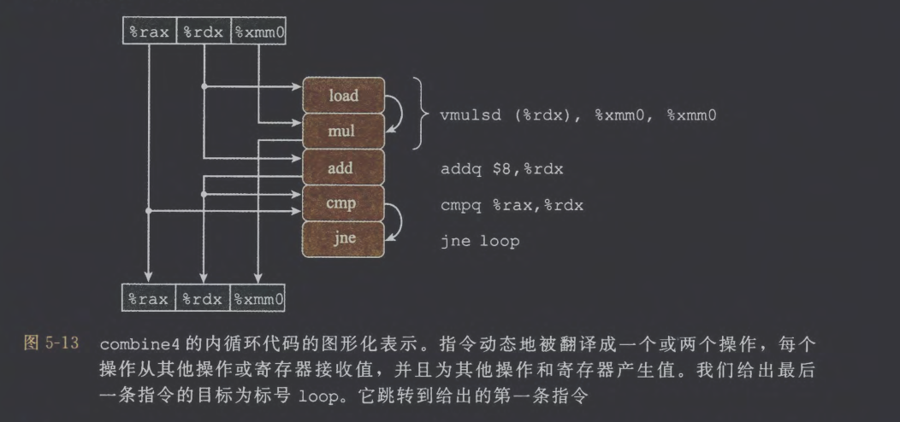

# 1. 优化编译器的能力和局限性

```C
void twiddle1(long *xp, long *yp){
	*xp += *yp;
	*xp += *yp;
}
void twiddle2(long *XP, long *yp){
	*xp += 2*(*yp);
}
```

由于编译器并不能保证xp与yp指向的不是同一块地址空间，所以编译器不会对twiddle1函数进行优化，这种情况被称为内存别名使用(memory aliasing)
# 2. 表示程序性能

引入CPE(Cycles per Elements)代表程序性能，CPE为平均处理一个元素所需要的 CPU 周期数，即在一个循环中，单独处理一个元素需要多少时钟周期，独立于数据规模 n
# 3. 程序示例

```C
typedef struct {
    long len;
    data_t *data;
} vec_rec, *vec_ptr;

typedef long data_t;
int get_vec_element(vec_ptr v, long index, data_t *dest) {
    if (index < 0 || index >= v->len)
        return 0;
    *dest = v->data[index];
    return 1;
}

#define IDENT 0
#define OP +

//采用某种运算，将向量中的所有元素合并成一个值
void combine1(vec_ptr v, data_t *dest) {
    long i;
    *dest = IDENT;
    for (i = 0; i < vec_length(v); i++) {
        data_t val;
        get_vec_element(v, i, &val);
        *dest = *dest OP val;
    }
}
```
# 4. 消除循环的低效率

```C
/* Move call to vec_length out of loop */
void combine2(vec_ptr v, data_t•dest) {
	long i;
	long length= vec_length(v);
	*dest = IDENT;
	for (i = O; i < length; i++) {
		data_t val;
		get_vec_element(v, i, &val);
		*dest =*dest OP val;
	}
}
```

这类优化被称为代码移动，将需要运算多次但结果不会改变的计算移动到循环外
# 5. 减少过程调用

```C
data_t *get_vec_start(vec_ptr v) {
	return v->data;
}

/* Direct access to vector data */
void combine3(vec_ptr v, data_t *dest) {
	long i;
	long length= vec_length(v);
	data_t *data= get_vec_start(v);
	*dest = IDENT;
	for (i = 0; i < length; i++) {
		*dest = *dest OP data[i];
	}
}
```

每次循环迭代都会调用get_vec_element函数获取下一个向量元素，这种做法十分低效，所以直接访问数组首地址+偏移量的方式来获取元素会更高效，但这种方法也会破坏抽象及封装性。
# 6. 消除不必要的内存引用

通过查看combine3的汇编代码，可以发现每轮循环都会经历两次读内存(%rbx,%rdx)，以及一次写内存(%rbx)操作，考虑通过临时变量的方式消除这种不必要的内存读写

```asm
# combine3 inner loop (data_t = double, OP = *)
# dest        → %rbx
# data + i   → %rdx
# data+len  → %rax

.L17:
loop:
    vmovsd  (%rbx), %xmm0
        # 从 *dest 读出累积值
        # 这是 combine3 最大的性能瓶颈之一（每次循环都读一遍）
    vmulsd  (%rdx), %xmm0, %xmm0
        # xmm0 = xmm0 * data[i]
        # 从内存读取 data[i]，与当前累计值相乘
    vmovsd  %xmm0, (%rbx)
        # 把结果写回 *dest
        # 又一次内存访问，每次循环都写
    addq    $8, %rdx
        # data+i 前进到下一个 double 元素
    cmpq    %rax, %rdx
        # 是否到达 data + length?
    jne     .L17
        # 没到则继续循环
```

```C
void combine4(vec_ptr v, data_t *dest) {
    long i;
    long length = vec_length(v);
    data_t *data = get_vec_start(v);
    data_t acc = IDENT;
    for (i = 0; i < length; i++) {
        acc = acc OP data[i];
    }
    *dest = acc;
}
```

通过查看combine4的汇编代码，可以发现编译器使用%xmm0来保存累计值

```asm
# Inner loop of combine4  (data_t = double, OP = *)
# acc    在 %xmm0
# data+i 在 %rdx
# data+len 在 %rax

.L25:
loop:
    vmulsd  (%rdx), %xmm0, %xmm0
        # acc = acc * data[i]
        # 从内存读取 data[i] 到流水线
        # 乘法结果写回到 %xmm0（寄存器累积，不写内存）
    addq    $8, %rdx
        # data+i += 8
        # double 类型每个元素 8 字节
    cmpq    %rax, %rdx
        # 检查是否到达 data+len
    jne     .L25
        # 没到末尾则继续循环
```
# 7. 理解现代处理器
## (1) 整体操作

现代微处理器通常是乱序的（指令执行的顺序不一定与机器级程序中顺序一致）、超标量的（每个时钟周期执行多个操作）

寄存器重命名技术是指CPU内部使用大量的物理寄存器，编译器/汇编中看到的是有限的寄存器，由寄存器重命名表记录

乱序执行是指CPU不按原码顺序执行，而是
1. 先取很多指令
2. 看哪些指令可以提前执行（没有依赖）
3. 乱序发给不同功能单元执行
4. 统一退役，按顺序提交结果
5. 分支预测错误就重新执行
## (2) 功能单元的性能

功能单元的性能由以下指标决定：
- 延迟：做完一次运算需要多少时间
- 发射时间：两次相同运算之间的最小周期间隔
- 容量：同类型的功能单元有几份

|运算|整数延迟|整数发射|整数容量|浮点延迟|浮点发射|浮点容量|
|---|---|---|---|---|---|---|
|加法|1|1|4|3|1|1|
|乘法|3|1|1|5|1|2|
|除法|3–30|3–30|1|3–15|3–15|1|
## (3) 处理器操作的抽象模型

上图顶部的方框表示循环开始时寄存器的值，而底部的方框表示最后寄存器的值
# 8. 循环展开

循环展开是指通过增加每次迭代计算的元素的数量，减少循环的迭代次数。

```C
/* 2 x 1 loop unrolling */
void combine5(vec_ptr v, data_t *dest)
{
    long i;
    long length = vec_length(v);
    long limit  = length - 1;
    data_t *data = get_vec_start(v);
    data_t acc = IDENT;
    /* Combine 2 elements at a time */
    for (i = 0; i < limit; i += 2) {
        acc = (acc OP data[i]) OP data[i+1];
    }
    /* Finish any remaining elements */
    for (; i < length; i++) {
        acc = acc OP data[i];
    }
    *dest = acc;
}
```
# 9. 提高并行性

由于硬件执行加法和乘法的功能单元是完全流水化的，而之前的代码中将累计值存放在单一变量acc中，在前面的计算完成前都不能计算acc的新值
## (1) 多个累积变量

```C
/* 2×2 loop unrolling + two accumulators */
void combine6(vec_ptr v, data_t *dest) {
    long i;
    long length = vec_length(v);
    long limit  = length - 1;
    data_t *data = get_vec_start(v);
    
    data_t acc0 = IDENT;  // 累积偶数下标
    data_t acc1 = IDENT;  // 累积奇数下标
    /* Combine 2 elements per iteration */
    for (i = 0; i < limit; i += 2) {
        acc0 = acc0 OP data[i];     // even index
        acc1 = acc1 OP data[i+1];   // odd index
    }
    /* Process remaining one element if length is odd */
    for (; i < length; i++) {
        acc0 = acc0 OP data[i];
    }
    /* Final merge */
    *dest = acc0 OP acc1;
}
```

这个方案将依赖链改为如下两条完全独立、无数据相关的链

```nginx
acc0 → acc0 → acc0 → ...
acc1 → acc1 → acc1 → ...
```
## (2) 重新结合变换

```C
/* 2×1a loop unrolling with reassociation */
void combine7(vec_ptr v, data_t *dest) {
    long i;
    long length = vec_length(v);
    long limit  = length - 1;
    data_t *data = get_vec_start(v);
    data_t acc = IDENT;
    /* Combine 2 elements at a time, but reassociated */
    for (i = 0; i < limit; i += 2) {
        acc = acc OP (data[i] OP data[i+1]);
    }
    /* Finish remaining elements */
    for (; i < length; i++) {
        acc = acc OP data[i];
    }
    *dest = acc;
}
```

这里采用`acc OP (data[i] OP data[i+1])`会允许`data[i] OP data[i+1]`优先独立于acc进行运算，使CPU在执行该指令时可以同时处理其他操作（地址计算等），但仍然不如 combine6 完全分为 acc0 和 acc1 两条独立链
# 10. 优化合并代码的结果小结
# 11. 一些限制因素
## (1) 寄存器溢出

- 当循环展开的并行度 k 变得过大时，累积变量的数量超过可用寄存器数，编译器不得不把部分累积变量“溢出”到内存（通常是栈）上
- 这样每步更新都需要把累积值从内存读回寄存器、计算、再写回内存，使本来依靠寄存器高速执行的并行优势被内存访问的高延迟抵消，最终不仅无法获得更好的 CPE，性能甚至会变差
## (2) 分支预测和预测错误处罚

- 不要过分关心可预测的分支：
	- 现代处理器中的分支预测逻辑非常善于辨别不同的分支指令的有规律的模式和长期的趋势
	- 例如，在合并函数中结束循环的分支通常会被预测为选择分支，因此只在最后一次会导致预测错误处罚

- 书写适合用条件传送实现的代码：

```C
void minmax1(long a[], long b[], long n) {
    for (long i = 0; i < n; i++) {
        if (a[i] > b[i]) {
            long t = a[i];
            a[i] = b[i];
            b[i] = t;
        }
    }
}

void minmax2(long a[], long b[], long n) {
    for (long i = 0; i < n; i++) {
        long min = a[i] < b[i] ? a[i] : b[i];
        long max = a[i] < b[i] ? b[i] : a[i];
        a[i] = min;
        b[i] = max;
    }
}
```

这里的 minmax2 采用条件传送机制可以提高程序性能（无需分支预测）
# 12. 理解内存性能
## (1) 加载的性能

- combine 的数组访问是 `data[i]` → 地址可提前计算 → load 不在关键路径，所以 combine 的性能瓶颈是运算延迟或加载吞吐量
- 而对于链表结构， `ls = ls->next` 是真依赖链，下一次 load 必须等上一次 load 完成，因此链表访问的 CPE = load latency ≈ 4 cycles
## (2) 存储的性能

```C
void write_read(long *src, long *dst, long n)
{
    long cnt = n;
    long val = 0;
    while (cnt) {
        *dst = val;      // store
        val = (*src) + 1; // load
        cnt--;
    }
}
```

该函数的性能完全取决于 load 是否依赖刚刚的 store，CPU 为了保证内存一致性，如果 load 的内存地址可能与 store 相同，就必须等待 store 的结果可见
# 13. 应用：性能提高技术
# 14. 确认和消除性能瓶颈
## (1) 程序剖析

Unix 系统提供了一个剖析程序 GPROF
1. 确定程序中每个函数花费了多少 CPU 时间
2. 计算每个函数被调用的次数，以执行调用的函数来分类
## (2) 使用剖析程序来指导优化
# 15. 小结

这章是我阅读 CSAPP 这本书的倒数第3章，我也更加感觉到 CSAPP 只是一个目录，提供某些方面最初步的介绍。就比如优化程序性能这一章，针对 combine 函数不断优化，直到达到理论上的最优解。我个人感觉这章教材讲解的也不是很清楚，优化的细节也不是很全面。我自己对这方面兴趣不大，之后再深入研究也不太现实了。最后还剩下信息的表示与处理、处理器体系结构这两章，我打算最后看处理器体系结构这一章，再结束这本书后我打算仿照 NJU 的 Project-N 项目，用软件尝试去实现一套完整的、性能不错的硬件，但这也只是目前的想法罢了，具体能做到哪一步还不知道。

2025.11.8 22:17完成本章内容