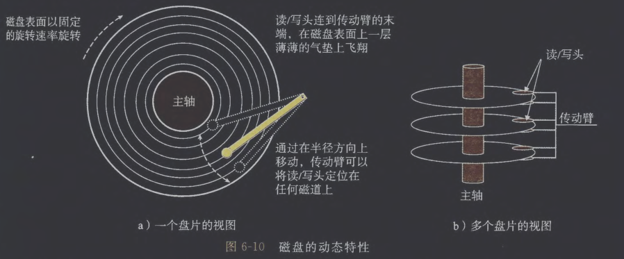
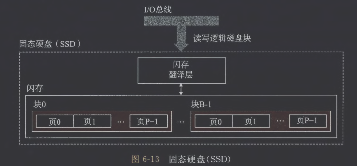
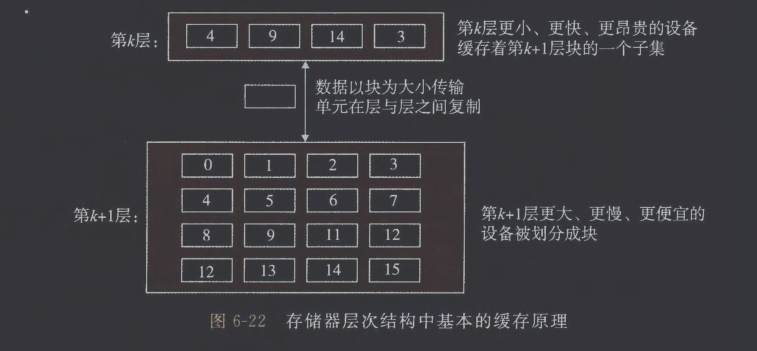
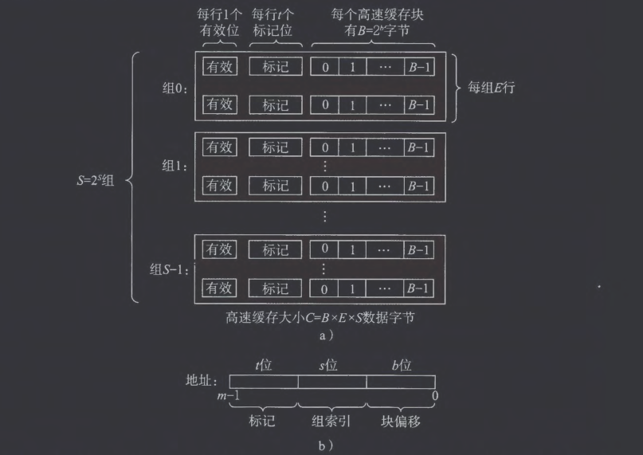
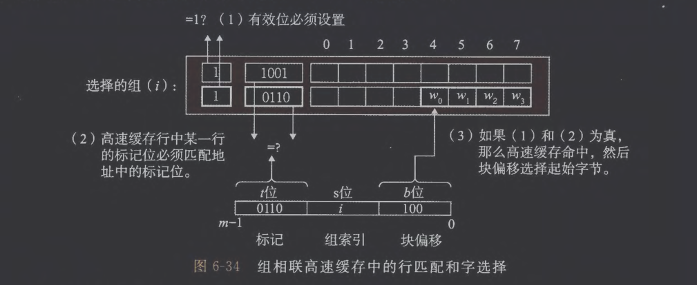
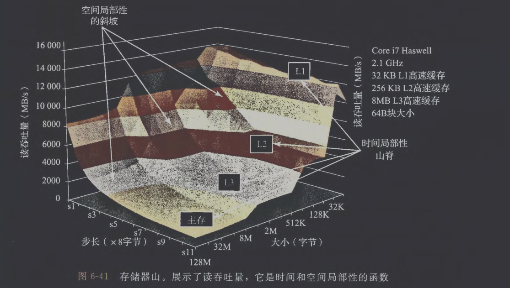

# 1. 存储技术
## (1) 随机访问存储器

随机访问存储器(RAM)分为静态(SRAM)和动态(DRAM)。SRAM速度更快，价格更高，通常用作高速缓存存储器。DRAM用作主存以及图形系统的帧缓冲区。

1. SRAM：将每个位存储在一个双稳态的存储器单元里，实现只要有电就能保持其值，受到干扰也能恢复到稳定值。

2. DRAM：将每个位存储为对一个电容的充电。对干扰敏感，电压受到扰乱就不会恢复。遇到漏电时，内存系统需要周期性地通过读出，然后重写来刷新内存每一位。有些系统会采用纠错码。

3. 传统的DRAM：
   DRAM芯片中的单元被分为$r$行$c$列共$r\cdot c=d$个超单元，每个超单元由$w$个DRAM单元组成。每个超单元有形如$(i,j)$的地址。

   每个DRAM芯片被连接到称为内存控制器的电路，该电路可以一次读入或读出$w$位信息。为读出超单元$(i,j)$的信息，内存控制器发送行地址$i$，DRAM响应是将行$i$的所有内容复制到内部行缓冲区。接下来内存控制器发送列地址$j$，DRAM响应是复制出超单元$(i,j)$的$w$位并发送到内存控制器。

4. 内存模块：
   示例模块采用8个64 Mbit的$8M\times 8$的DRAM芯片，总共存储64MB。

   如果要获取地址A的内容，内存控制器会将A转换为一个超单元地址$(i,j)$并广播给每个DRAM，每个DRAM响应它的$(i,j)$超单元的8位内容。收集这些输出并合并为一个64位的字返回给内存控制器。

5. 增强的DRAM：包括快页模式、拓展数据输出、同步等。

6. 非易失性存储器：如果断电，DRAM和SRAM会丢失它们的信息。而闪存则是一类非易失性存储器，固态硬盘（SSD）就是基于闪存的。

7. 访问主存：数据流通过总线完成CPU与主存之间的数据传送。
## (2) 磁盘存储

1. 磁盘构造
   磁盘由盘片构成，每个盘片有两个表面覆盖磁性记录材料。盘片中央有一个以固定速率旋转的主轴。

   每个表面由一组称为磁道的同心圆构成，每个磁道被划分为一组扇区。每个扇区通常包含512字节数据位，扇区间的间隙不储存数据。

2. 磁盘容量

$$磁盘容量= \frac{\text{字节数}}{\text{扇区}} \times \frac{\text{平均扇区数}}{\text{磁道}} \times \frac{\text{磁道数}}{\text{表面}} \times \frac{\text{表面数}}{\text{盘片}} \times \frac{\text{盘片数}}{\text{磁盘}}$$

3. 磁盘操作


   对扇区的访问时间由寻道时间（移动传动臂）、旋转时间（扇区旋转到读/写头）和传送时间（传送数据）决定。

4. 逻辑磁盘块
   现代磁盘将磁盘封装为B个扇区大小的逻辑块的序列，编号为$0,1,\cdots B-1$。由磁盘控制器通过（盘面，磁道，扇区）三元组维护逻辑块号与实际磁盘扇区之间的映射关系。

5. 连接I/O设备
   通用串行总线控制器、图形卡、主机总线适配器被连接到总线。

6. 访问磁盘
   - CPU通过向磁盘控制器端口（如0xa0）发送存储指令发起读请求：第一条指令发送命令和参数（如是否中断），第二条指定逻辑块号，第三条指定内存目标地址。
   - 随后CPU转而执行其他任务，实现计算与I/O并行。磁盘控制器自行将逻辑块号转换为扇区地址，读取数据后，通过DMA（直接内存访问）技术，直接将数据写入主存。
   - 传输完成后，磁盘控制器向CPU发送中断信号。
   - CPU响应中断，暂停当前工作，执行操作系统中断处理程序记录I/O完成，最后恢复被中断的任务。
## (3) 固态硬盘


SSD的写操作慢于读操作。只有在一页所属的块被完全擦除后才能写这一页。如果写操作试图修改一个已经有数据的页，那么该块中所有带数据的页都必须被复制到一个新块。同时SSD容易磨损，通过平均磨损逻辑可以削减这个缺点。
## (4) 存储技术趋势
# 2. 局部性
## (1) 对程序数据引用的局部性
一个连续向量中，每隔$k$个元素进行访问，就称为步长为$k$的引用模式。程序的空间局部性随步长增加而下降。如下函数步长为$N$，不具备很好的局部性。
```C
int sumarray(int a[M][N])
{
	int i, j, sum = 0;
	for(j=0;j<N;++j)
		for(i=0;i<M;++i)
			sum += a[i][j];
	return sum;
}
```
## (2) 取指令的局部性
- 指令局部性，也称为时间局部性，是指CPU在短时间内很可能再次执行刚刚执行过的指令。
- 当CPU第一次执行一条指令时，它会从内存中取出这条指令，同时也会把这条指令以及它附近的一大块指令（因为还有“空间局部性”）一起加载到高速缓存中
# 3. 存储器层次结构
## (1) 缓存一般性概念


数据总是以块大小为传送单元在第$k$层和第$k+1$层之间来回复制的，更高层次的块相对更小，例如在L0和L1之间的传送采用1个字大小的块。
## (2) 缓存不命中
1. 如果第$k$层的缓存是空的，那么对任何数据对象的访问都会不命中，这类不命中称为冷不命中。
2. 只要发生了不命中，第$k$层缓存就必须执行某种放置策略，确定把从第$k+1$层中取出的块放到哪里。其中一种放置策略就是模$i$放置。
3. 这种限制性的放置策略会引发冲突不命中，比如反复请求块0，块8，块0，块8……
4. 如果工作集大小超过缓存大小，就会经历容量不命中。
# 4. 高速缓存存储器
## (1) 通用的高速缓存存储器组织结构

考虑一个计算机系统，每个存储器地址有$m$位，形成$M=2^m$个不同的地址。



这样一个机器的高速缓存被组织成一个有$S=2^s$个高速缓存组(cache set)的数组。每个组包含$E$个高速缓存行(cache line)。每个行是由一个$B= 2^b$字节的数据块(block)，指明该行是否存储有意义的数据的有效位(valid bit)以及用来比较的标记位(tag bit)构成。

而一个地址是由$t$位标记位、$s$位组索引和$b$位块偏移构成的。这里需要注意每行不占用$m$位，实际上，缓存行的大小远大于机器位数(32/64)。
## (2) 直接映射高速缓存

- 每组只有一行（$E=1$）的高速缓存称为直接映射高速缓存。
- 高速缓存确定一个请求是否命中，然后抽取出被请求的数据的过程分为3步：组选择、行匹配、字抽取。
	1. 组选择：高速缓存从$w$的地址中间抽取出$s$个组索引位。
	2. 行匹配：该行有效位被设置，同时行标记位与地址中的标记位匹配，得到缓存命中。
	3. 字选择：地址中的块偏移位提供了所需数据的第一个字节的偏移。
	4. 行替换：缓存不命中，从下一层中取出被请求的块存储在现存行。
## (3) 组相联高速缓存



当发生缓存不命中时，需要进行行替换，此时会采用LFU(Least-Frequently-Used)策略。
## (4) 全相联高速缓存

- 只有一个组，该组包含所有高速缓存行，此时地址中不含组索引位，只适合做小型的高速缓存。
# 5. 编写高速缓存友好的代码
# 6. 高速缓存对程序性能的影响



- 使用分块的技术可以提高内循环的时间局部性。
# 7. 小结