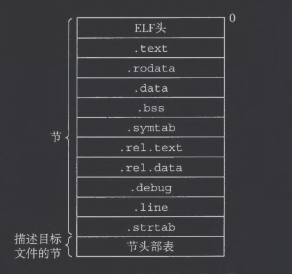
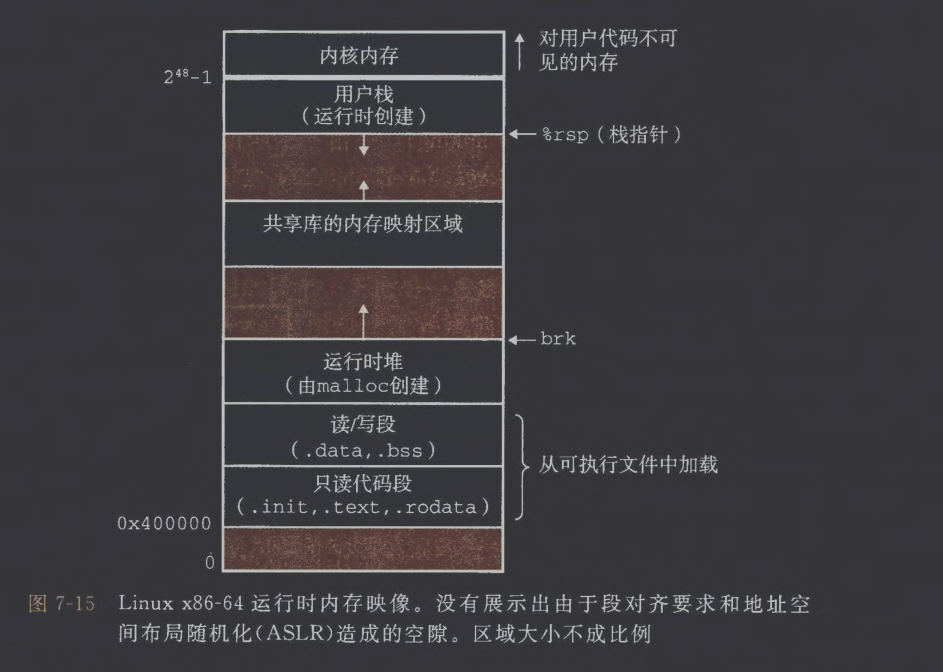
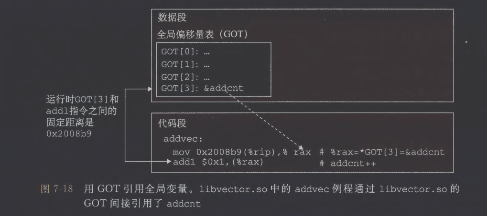
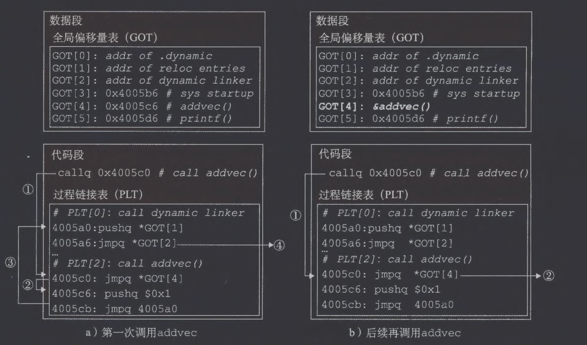

# 1. 编译器驱动程序

```C
/*code/link/main.c*/
int sum(int *a, int n);

int array[2] = {1, 2};

int main()
{
	int val = sum(array, 2);
	return val;
}

/*code/link/sum.c*/
int sum(int *a, int n)
{
	int i, s = 0;
	for(i=0;i<n;i++)
		s += a[i];
	return s;
}
```

在shell中通过`gcc -Og -o prog main.c sum.c`命令调用GCC驱动程序，使用`-v`可以查看完整步骤。

1. 运行C预处理器(cpp)将C的源程序`main.c`翻译成中间文件`main.i`，由于现代gcc不再显式调用独立的cpp程序，所以终端输出格式与教材上不同
2. 运行C编译器(cc1)将`main.i`翻译成`main.s`
3. 运行汇编器(as)将`main.s`翻译成一个可重定位目标文件`main.o`
4. 运行链接器程序(ld)将`main.o`，`sum.o`等文件组合起来并创建一个可执行目标文件`prog`

在现代gcc中会将前2步合并为1步，所以实际的编译结果是（1，3条均为简化），最后一步会用collect2代替ld，它会自动加上各种运行库、启动文件（比如 `crt1.o`、`crti.o`、`crtn.o`）、库路径、保护选项：

```shell
cc1 main.c -o main.s

 as -v --64 -o /tmp/cc4ijzzO.o /tmp/cc7rsol5.s

collect2/ld -o prog main.o [系统启动文件] -lc -lgcc
```
# 2. 静态链接

静态链接器以一组可重定位目标文件和命令行参数作为输入，生成一个完全链接的、可以加载和运行的可执行目标文件作为输出。此后链接器通过符号解析和重定位
# 3. 目标文件

目标文件有3种形式：
1. 可重定位目标文件
2. 可执行目标文件
3. 共享目标文件

编译器和汇编器生成可重定位目标文件（包括共享目标文件）。链接器生成可执行目标文件。
# 4. 可重定位目标文件


|           |                                  |
| --------- | -------------------------------- |
| ELF头      | 目标文件类型、机器类型、节头部表中条目的大小和数量等       |
| .text     | 已编译程序的机器代码                       |
| .rodata   | 只读数据，比如printf语句中的格式串             |
| .data     | 已初始化的全局和静态C变量（局部变量保存在栈中）         |
| .bss      | 未初始化或被初始化为0的全局和静态C变量             |
| .symtab   | 符号表，存放函数及全局变量                    |
| .rel.text | 一个.text节中位置的列表（当不同文件组合时需要修改这些位置） |
| .rel.data | 所有全局变量的重定位信息                     |
| .debug    | 调试符号表，需要-g选项编译                   |
| .line     | 原始C源程序中的行号和.text节中机器指令之间的映射      |
| .strtab   | 字符串表                             |
# 5. 符号和符号表

```C
typedef struct {
    int        name;                /* String table offset */
    char     type:4,              /* Function or data (4 bits) */
             binding:4;          /* Local or global (4 bits) */
    char     reserved;          /* Unused */
    short   section;             /* Section header index */
    long     value;                 /* Section offset or absolute address */
    long     size;                  /* Object size in bytes */
} Elf64_Symbol;
```

```asm
Num:  Value                        Size      Type        Bind       Vis       Ndx      Name
  8:  0000000000000000     24   FUNC     GLOBAL   DEFAULT      1      main
  9:  0000000000000000      8   OBJECT  GLOBAL   DEFAULT     3     array
 10:  0000000000000000      0   NOTYPE  GLOBAL  DEFAULT  UND     sum
```

含义：
- `main`：在`.text`节中定义的函数；
- `array`：在`.data`节中定义的全局变量；
- `sum`：未定义（`UND`），需要链接别的目标文件提供定义。
# 6. 符号解析

## (1) 链接器如何解析多重定义的全局符号

Linux链接器使用下面的规则来处理多重定义的符号名：

1. 不允许有多个同名的强符号。
2. 如果有一个强符号和多个弱符号同名，那么选择强符号。
3. 如果有多个弱符号同名，那么从这些弱符号中任意选择一个。

- 未初始化的变量弱于已初始化的变量
- 若一个文件中将x定义为int类型，而另一个文件定义为double类型，由于占据字节数量不同，所以可能覆盖内存
## (2) 与静态库链接

当链接器构造可执行文件时，它的行为是：

1. 从输入目标文件（如 `main.o`）开始；
2. 找出未定义符号（比如 `addvec`、`printf`）；
3. 在静态库（如 `libvector.a`、`libc.a`）中查找这些符号；
4. 只复制定义了这些符号的目标模块（例如`addvec.o`）到最终的可执行文件；
5. 没被引用的模块（如 `multvec.o`）不会被复制。
## (3) 链接器如何使用静态库来解析引用

链接器维护3个集合：

| 名称    | 含义                             |
| ----- | ------------------------------ |
| **E** | 需要合并到可执行文件的目标文件集合              |
| **U** | 当前还未解析的符号集合（undefined symbols） |
| **D** | 已定义的符号集合（defined symbols）      |

步骤：
- 目标文件 (`.o`)：
    - 加入E
    - 更新U（新增引用的符号）
    - 更新D（新增定义的符号）
- 静态库 (`.a`)：
    - 检查U里的每个符号，看是否有该库的成员`.o`定义了它
    - 若有，就把该成员文件加入E
    - 更新U和D
    - 重复直到U不再变化
    - 没有匹配到的成员就丢弃，不会加入E
- 扫描结束：
    - 如果U仍然非空，说明有符号没解析 → 链接失败
    - 否则把E中所有`.o`合并、重定位，生成最终可执行文件
# 7. 重定位

重定位由2步组成：

1. 重定位节和符号定义：将所有相同类型的节合并成同一类型的新的聚合节，并将运行时内存地址赋给新的聚合节。此时程序中的每条指令和全局变量都有唯一的运行时内存地址。
2. 重定位节中的符号引用：链接器修改代码节和数据节中对每个符号的引用，使得它们指向正确的运行时地址
## (1) 重定位条目

```C
typedef struct {
  long offset;   // 需要修改的位置(在节内的偏移)
  long type:32;  // 重定位类型（如何改）
  long symbol:32;// 符号表索引（要改成谁的地址）
  long addend;   // 偏移常数
} Elf64_Rela;
```

在链接的过程中，首先链接器将所有.text节合并成一个大的.text段。比如有main.c和foo.c两个文件参与链接，并且main.c中调用了`foo()`函数，那么
foo()的最终地址 = foo.o的.text节起始地址 + foo()的节内偏移
## (2) 重定位符号引用

```C
foreach section s {
	foreach relocation entry r {
		refptr = s + r.offset; /*ptr to reference to be relocated*/
		
		/*Relocate a PC-relative reference*/
		if(r.type == R_X86_64_PC32) {
			refaddr =  ADDR(s) + r.offset; /*ref`s runtime address*/
			/*ADDR(r.symbol)表示符号的运行时地址*/
			*refptr = (unsigned)(ADDR(r.symbol) + r.addend - refaddr);
		}
		
		/*Relocate an absolute reference*/
		if(r.type == R_X86_64_32)
			*refptr = (unsigned)(ADDR(r.symbol) + r.addend);
	}
}
```
# 8. 可执行目标文件
# 9. 加载可执行目标文件


1. 创建如上图的内存映像
2. 将可执行文件的片复制到代码段和数据段
3. 加载器跳转到程序的入口点`_start`函数处
4. `_start`函数调用系统启动函数`__libc_start_main`初始化执行环境并调用`main`函数
# 10. 动态链接共享库

共享库在运行或加载时，可以加载到任意的内存地址，并和内存中的程序链接起来，由动态链接器完成。共享库也称为共享目标(shared object)，在Linux系统下用.so后缀，在Windows系统下为DLL。
# 11. 从应用程序中加载和链接共享库

当进行分发软件或构建高性能Web服务器时，需要应用程序在运行时动态加载和链接某个共享库。

```C
#include <dlfcn.h>
//返回：若成功则为指向句柄的指针，若出错则为 NULL。
void *dlopen(const char *filename, int flag);
//输入是一个指向前面已经打开了的共享库的句柄和一个 symbol 名字，如果该符号存在，就返回符号的地址，否则返回 NULL 。
void *dlsym(void *handle, char *symbol);
//卸载该共享库，返回：若成功则为0 ,若出错则为-1。
int dlclose (void *handle);
//返回：如果前面对 dlopen 、dlsym 或 dlclose 的调用失败 ，则为错误消息，如果前面的调用成功，则为 NULL。
const char *dlerror(void);
```

具体使用方法见`CodeDemo/link/dll.c`
# 12. 位置无关代码
## (1) PIC数据引用

由于无论在内存的何处加载目标模块，数据段与代码段的距离都保持不变。编译器在数据段开始的地方创建全局偏移量表（GOT）。

## (2) PIC函数调用

采用延迟绑定策略，即将过程地址的绑定推迟到第一次调用该过程时。如果一个目标模块调用定义在共享库中的任何函数，那么它就有自己的GOT和PLT。GOT是数据段的一部分，而PLT是代码段的一部分。

首次调用：
1. 进入`addvec`的PLT条目`PLT[2]`
2. 跳转到`GOT[4]`，由于每个GOT条目初始时都指向它对应的PLT条目的第二条指令，所以将控制传回到`PLT[2]`的下一条指令。
3. 在把`addvec`的 ID(0x1) 压入栈中之后，`PLT[2]`跳转到`PLT[0]`
4. `PLT[0]`通过`GOT[1]`间接地把动态链接器的一个参数压入栈中，然后通过`GOT[2]`间接跳转进动态链接器中。动态链接器使用两个栈条目来确定`addvec`的运行时位置，用这个地址重写`GOT[4]`, 再把控制传递给`addvec`。
# 13. 库打桩机制
# 14. 处理目标文件的工具
# 15. 小结

这一章感觉教材讲的不是很清楚，读下来感觉有非常多的细节没有涉及到。之后打算找时间看看《程序员的自我修养：链接、装载与库》这本书。