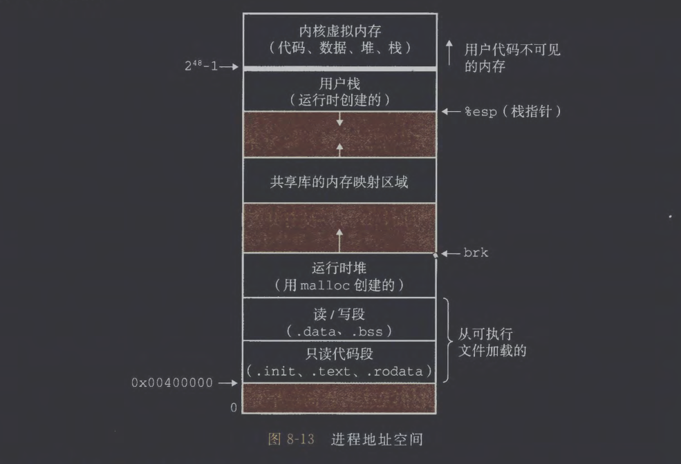
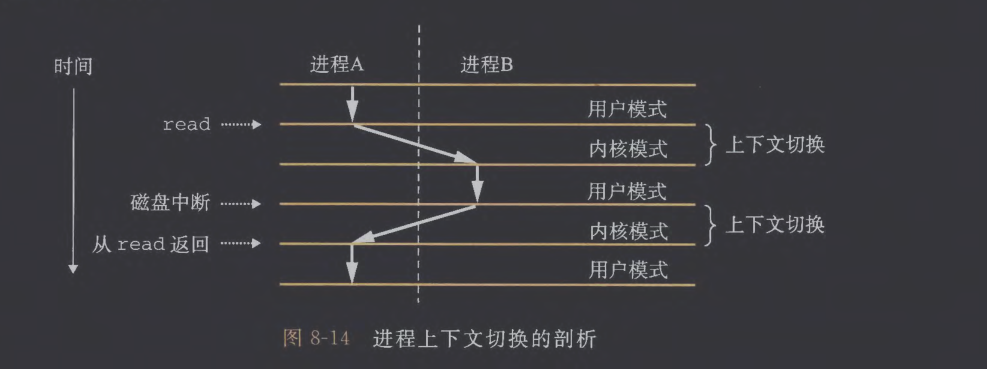
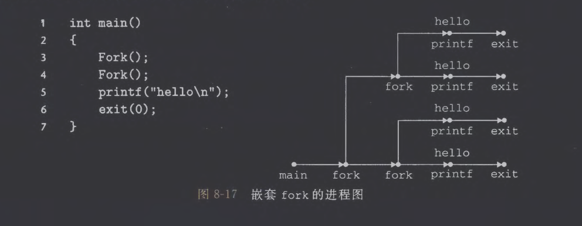

# 1. 异常

当发生虚拟内存缺页、算术溢出、除零等事件时，处理器通过异常表调用异常处理程序。
## (1) 异常处理

系统为每种类型的异常都分配了一个唯一的非负整数的异常号，如除零、缺页、非法内存访问、断点等。在系统启动时，操作系统分配和初始化一张异常表。

当处理器检测到事件并确定异常号k后，通过异常表的表目k跳转到相应的处理程序。异常表的起始地址存放于异常表基址寄存器中。

如果控制从用户程序转移到内核，所有这些项目都被压到内核栈中，而不是压到用户栈中，并且异常处理程序运行在内核模式下。
## (2) 异常的类别

| 类别  | 原因        | 异步/同步 | 返回行为    |
| --- | --------- | ----- | ------- |
| 中断  | 来自IO设备的信号 | 异步    | 下一条指令   |
| 陷阱  | 有意的异常     | 同步    | 下一条指令   |
| 故障  | 潜在可恢复的错误  | 同步    | 可能为当前指令 |
| 终止  | 不可恢复      | 同步    | 不返回     |
## (3) Linux/x86-64系统中的异常

| 异常号    | 描述        | 异常类别  | 解释                 |
| ------ | --------- | ----- | ------------------ |
| 0      | 除法错误      | 故障    |                    |
| 13     | 一般保护故障    | 故障    | Segmentation fault |
| 14     | 缺页        | 故障    |                    |
| 18     | 机器检查      | 终止    | 硬件错误               |
| 32~255 | 操作系统定义的异常 | 中断或陷阱 |                    |

在Linux的C程序中，可以使用`syscall`函数进行任何系统调用，从系统调用返回时，返回值被存放在`%rax`寄存器，-4095~-1表明发生错误，对应errno。
# 2. 进程

系统中的每个程序都运行在某个进程的上下文中，上下文包括存放在内存中的程序的代码和数据、栈、通用寄存器的内容、程序计数器、环境变量以及打开文件描述符等。
## (1) 逻辑控制流

每个进程执行其逻辑流的一部分，然后被抢占（暂时挂起）并轮到其他进程。
## (2) 并发流
## (3) 私有地址空间

进程为每个程序提供它的私有地址空间。以下是通常的地址空间的结构：

## (4) 用户模式和内核模式

处理器采用某一控制寄存器的模式位记录当前进程的状态，Linux提供/proc文件系统允许用户模式进程访问内核数据结构的内容，比如CPU类型位于/proc/cpuinfo。
## (5) 上下文切换

步骤：
1. 保存当前进程的上下文
2. 恢复某个先前被抢占的进程被保存的上下文
3. 将控制传递给这个新恢复的进程

当内核代表用户执行系统调用时，也可能发生上下文切换：如果一个read系统调用需要访问磁盘，内核可以执行另一个进程，而不是等待数据从磁盘到达。或者sleep系统调用时，内核也可以决定不将控制返回给调用进程。

 所有系统都有某种产生周期性计时器中断的机制，通常为1~10ms，每次发生定时器中断时，内核判定当前进程已经运行足够长的时间，并切换到新的进程。
# 3. 系统调用错误处理

```C
void unix_error(char *msg)
{
	fprintf(stderr, "%s: %s\n", msg, strerror(errno));
	exit(0);
}

pid_t Fork(void)
{
	pid_t pid;
	if((pid = fork()) < 0)
		unix_error("Fork error");
	return pid;
}
```
# 4. 进程控制
## (1) 获取进程ID

```C
#include <sys/types.h>
#include <unistd.h>

//返回：调用者或其父进程的PID
pid_t getpid(void);
pid_t getppid(void);
//pid_t在Linux系统下types.h中被定义为int
```
## (2) 创建和终止进程

进程总是处于3个状态之一：
1. 运行
2. 停止：收到`SIGSTOP, SIGTSTP, SIGTTIN, SIGTTOU`信号进程停止，直到收到`SIGCONT`信号进程再次运行。
3. 终止：进程终止有以下原因：收到一个终止进程的信号、从主程序返回、调用`exit`函数。

```C
#include <stdlib.h>

//以status退出状态来终止进程（或从主程序中返回一个整数值）
void exit(int status);
```

父进程通过调用`fork`函数创建一个新的运行的子进程，子进程得到与父进程相同的虚拟地址空间的副本，包括代码和数据段、堆、共享库以及用户栈。同时子进程可以读写父进程中打开的任何文件。

```C
#include <sys/types.h>
#include <unistd.h>

//返回：子进程返回0，父进程返回子进程的PID，如果出错则返回-1
pid_t fork(void);

int main()
{
	pid_t pid;
	int x = 1;
	pid = Fork();
	//Child
	if(pid == 0)
	{
		printf("child: x = %d\n", ++x);
		exit(0);
	}
	//Parent
	printf("parent: x = %d\n", --x);
	exit(0);
}
```

父进程与子进程并发执行，不能确定谁先执行到printf语句。子进程继承了父进程的stdout文件，所以两个输出都显示在屏幕上。



```bash
linux> ./fork
parent: x = 0
child: x = 2
```

## (3) 回收子进程

进程终止时，内核并不立即将其从系统中清除，直到其被父进程回收。一个终止但未被回收的进程称为僵死进程。若父进程已经终止，内核会安排init进程成为该“孤儿”的父进程并将其回收，init进程的PID被设置为1。

```C
#include <sys/types.h>
#include <sys/wait.h>

//返回：如果成功，则为子进程的 PID。若WNOHANG,则为0。如果其他错误，则为-1
pid_t waitpid(pid_t pid, int *statusp, int options);
```

| 参数      | 含义                                         |
| ------- | ------------------------------------------ |
| pid     | 决定要等待哪个子进程                                 |
| statusp | 如果不为NULL，用于存放子进程的退出状态信息                    |
| options | 修改默认等待行为（是否阻塞、是否也等停止的进程等）                  |
| 返回值     | 成功返回子进程 PID；如果WNOHANG且没有子进程结束则返回 0；错误返回 -1 |
1. 判定等待集合的成员（pid）

| pid 值 | 意义                  |
| ----- | ------------------- |
| > 0   | 等待指定PID的子进程         |
| -1    | 等待任意子进程             |
| 0     | 等待与当前进程在同一进程组的所有子进程 |
2. 默认行为(options=0)
	1. 阻塞当前父进程
	2. 等待集合中某个子进程结束（当pid=-1时需要循环调用waitpid直到所有子进程都终止）
	3. 返回该子进程的PID
	4. 内核释放该子进程占用的资源
3. 修改默认行为(options=WNOHANG, WUNTRACED, WCONTINUED)
	- WNOHANG：如果子进程还没结束，立刻返回0，不等待
	- WUNTRACED：支持返回被暂停的子进程（如收到`SIGSTOP`）
	- WCONTINUED：支持返回被恢复执行的子进程（收到`SIGCONT`）
4. 检查己回收子进程的退出状态(statusp)：若statusp参数非空，那么waitpid函数就会在status中放入子进程返回的状态信息，status是statusp指向的值，用以下的宏解析：

| 宏                    | 含义                      |
| -------------------- | ----------------------- |
| WIFEXITED(status)    | 是否“正常退出”（exit 或 return） |
| WEXITSTATUS(status)  | 返回一个正常终止的子进程的退出状态       |
| WIFSIGNALED(status)  | 是否被信号杀死                 |
| WTERMSIG(status)     | 导致终止的信号编号               |
| WIFSTOPPED(status)   | 是否被暂停                   |
| WSTOPSIG(status)     | 导致暂停的信号编号               |
| WIFCONTINUED(status) | 是否被SIGCONT恢复            |
5. 错误条件：
	- 若调用进程没有子进程，则waitpid返回-1，并设置errno为ECHILD
	- 若waitpid函数被信号中断，则返回-1，并设置errno为EINTR
6. wait函数：
	- 调用`wait(&status)`等价于调用`waitpid(-1, &status, 0)`
7. 调用示例：参考CodeDemo/ecf/waitpid2.c
## (4) 让进程休眠

```C
#include <unistd.h>

//返回：还要休眠的秒数
unsigned int sleep(unsigned int secs);
//总是返回-1，除非收到特定信号，否则pause使进程一直休眠
int pause(void);
```
## (5) 加载并运行进程

```C
#include <unistd.h>

//如果成功则不返回，如果错误则返回-1
int execve(const char *filename, const char *argv[], const char *envp[]);
```

`execve`函数加载并运行可执行目标文件`filename`，并且带有参数列表`argv`和环境变量列表`envp`。
- 参数列表`argv`指向一个以`null`结尾的指针数组，其中每个指针都指向一个参数字符串，通常`argv[0]`是可执行目标文件的名字。
- `envp`变量指向一个以`null`结尾的指针数组，其中每个指针指向一个环境变量字符串，每个串都是形如"name=value"的名字－值对，如`PWD=/usr/droh`。

`execve`加载了`filename`后调用启动代码，将控制传递给新程序的main函数，main函数一般有这样的形式：`int main (int argc, char *argv [], char *envp []);`。

Linux提供了函数来操作环境变量列表：

```C
#include <stdlib.h>

//返回：若存在则为指向name的指针，若无匹配的，则为NULL
char *getenv(const char *name);
//用newvalue替换掉name=oldvalue，并且只有overwrite非零才进行操作
//返回：若成功则为0,若错误则为-1
int setenv(const char *name, const char *newvalue, int overwrite);
//不返回
void unsetenv(const char *name);
```
## (6) 利用fork和execve运行程序
# 5. 信号
## (1) 信号术语

发送一个信号到目的进程分为以下步骤：
1. 发送信号：可能由于内核检测到系统事件（除零/子进程终止），或进程调用了kill函数显式要求内核发送一个信号给目的进程。
2. 接收信号：
	- 一个发出而没有被接收的信号叫做待处理信号。
	- 在任何时刻，一种类型至多只会有一个待处理信号。如果一个进程有一个类型为k的待处理信号，那么任何接下来发送到这个进程的类型为k的信号都不会排队等待，它们只是被简单地丢弃。
	- 一个进程可以选择阻塞某种信号，这样这个信号可以被发送，但不会被该进程接收。
## (2) 发送信号

每个进程都只属于一个进程组，进程组由一个正整数进程组ID标识。通常来说，子进程与父进程属于同一个进程组。若当前进程为15213，则`setpgid(0, 0)`会创建新的进程组15213，并将当前进程加入到这个进程组中。

```C
#include <unistd.h>

//返回：调用进程的进程组ID
pid_t getpgrp(void);
//将进程pid的进程组改为pgid，若pid=0则为当前进程的PID。若pgid=0，则用pid指定的进程的PID作为进程组ID
int setpgid(pid_t pid, pid_t pgid);
```

`/bin/kill`程序可以向其他进程发送任意的信号，例如`/bin/kill -9 15213`会发送信号SIGKILL给进程15213中的每个进程。

进程通过调用kill函数发送信号给其他进程。若pid=0，则发送信号sig给调用进程所在的进程组的每个进程，包括调用进程自己。若pid<0则发送信号sig给进程组|pid|中的每个进程。

```C
#include <sys/types.h>
#include <signal.h>

//返回：若成功则为0，错误则为-1
int kill(pid_t pid, int sig);
```

进程也可以通过调用alarm函数向自己发送SIGALRM信号。alarm函数安排内核在secs秒后发送一个SIGALRM信号给调用进程。

```C
#include <unistd.h>

//返回：前一次闹钟剩余的秒数，若以前没有设定闹钟，则为0 。
unsigned int alarm(unsigned int secs);
```
## (3) 接收信号

当内核将进程p从内核模式切换到用户模式时，会检查进程p未被阻塞的待处理信号的集合。若非空，则强制p接收信号。收到信号后会触发进程采取行为，一旦进程完成了该行为，就将控制传回逻辑控制流的下一条指令。

每种信号类型都有一个预定义的默认行为，包括：
1. 进程终止
2. 进程终止并转储内存
3. 进程停止（挂起）直到被SIGCONT信号重启
4. 进程忽略该信号

进程可以通过signal函数修改和信号相关联的默认行为，SIGSTOP和SIGKILL信号的默认行为不能被更改。

```C
#include <signal.h>
typedef void (*sighandler_t)(int);

//返回：若成功则为指向前次处理程序的指针，若出错则为SIG_ERR(不设置errno) 
sighandler_t signal(int signum, sighandler_t handler);
```

handler可以为`SIG_IGN`(忽略类型为signum的信号)、`SIG_DEL`(类型为signum的信号行为恢复为默认行为)、自定义函数地址(只要进程接收到信号signum就调用这个函数)

```C
void sigint_handler(int sig)
{
	printf("Caught SIGINT!\n");
	exit(0);
}
int main()
{
	if(signal(SIGINT, sigint_handler) == SIG_ERR)
		unix_error("signal error");
	pause();
	return 0;
}
```
## (4)  阻塞和解除阻塞信号

显式阻塞机制：

```C
#include <signal.h>

//返回：如果成功则为0,若出错则为-1 。
int sigprocmask(int how, const sigset_t *set, sigset_t *oldset);
int sigemptyset(sigset_t *set);                  //初始化set为空集合
int sigfillset(sigset_t *set);                       //将所有信号都添加到set中
int sigaddset(sigset_t *set, int signum);    //将signnum添加到set
int sigdelset(sigset_t *set, int signum);     //从set中删除signum
//返回：若signum是set的成员则为1,如果不是则为0,若出错则为-1
int sigismember(const sigset_t *set, int signum);
```

`sigprocmask`函数的行为依赖于`how`的取值：
- SIG_BLOCK：把set中的信号加入屏蔽字（新增阻塞）
- SIG_UNBLOCK：把set中的信号从屏蔽字中移除（解除阻塞）
- SIG_SETMASK：用set完全替换当前屏蔽字
## (5) 编写信号处理程序

具体代码见 CodeDemo/ecf/signal1.c 和 signal2.c
## (6) 同步流以避免并发错误

```C
void handler(int sig) {
    int olderrno = errno;               // 保存 errno，防止被 waitpid 改掉
    sigset_t mask_all, prev_all;
    pid_t pid;
    Sigfillset(&mask_all);              // 屏蔽所有信号的集合
    // 回收所有已经终止的子进程（避免僵尸）
    while ((pid = waitpid(-1, NULL, 0)) > 0) {
        Sigprocmask(SIG_BLOCK, &mask_all, &prev_all);  // 阻塞所有信号
        deletejob(pid);                               // 从全局 job list 删除子进程
        Sigprocmask(SIG_SETMASK, &prev_all, NULL);    // 恢复信号屏蔽字
    }
    // 如果错误不是“没有子进程”，那说明出了问题
    if (errno != ECHILD)
        Sio_error("waitpid error");
    errno = olderrno; // 恢复 errno
}

int main(int argc, char **argv) {
    int pid;
    sigset_t mask_all, mask_one, prev_one;
    
    Sigfillset(&mask_all);          // 包含所有信号
    Sigemptyset(&mask_one);         // 清空 mask_one
    Sigaddset(&mask_one, SIGCHLD);  // mask_one 只包含 SIGCHLD
    
    Signal(SIGCHLD, handler);       // 注册 SIGCHLD 信号处理函数
    initjobs();                     // 初始化全局作业列表
    
    while (1) {
        // ------------------------------------
        // (1) 在 fork 前阻塞 SIGCHLD
        // 防止子进程一退出，父进程的 handler 还没 addjob 就被打断
        // ------------------------------------
        Sigprocmask(SIG_BLOCK, &mask_one, &prev_one);
        if ((pid = Fork()) == 0) {  // 子进程
            // --------------------------------
            // (2) 子进程不需要继承阻塞状态
            // 子进程不关心 SIGCHLD（它不会有子进程）
            // 所以立即恢复信号屏蔽字
            // --------------------------------
            Sigprocmask(SIG_SETMASK, &prev_one, NULL);
            Execve("/bin/date", argv, NULL); // 执行 date 程序
        }
        // ------------------------------------
        // (3) 父进程安全地修改全局 job list
        // 此时 SIGCHLD 被阻塞，不会被 handler 打断
        // ------------------------------------
        Sigprocmask(SIG_BLOCK, &mask_all, NULL);  // 阻塞所有信号进入临界区
        addjob(pid);                              // 向全局 job list 添加新作业
        // 恢复之前的屏蔽字，解除 SIGCHLD 阻塞
        Sigprocmask(SIG_SETMASK, &prev_one, NULL);
        // ------------------------------------
        // (4) 到这里，父进程终于可以接收 SIGCHLD 了
        // 如果子进程已经退出、信号在阻塞时到达，内核会“立即递送”它
        // handler 会被调用，deletejob 会在正确时机执行
        // ------------------------------------
    }
    exit(0);
}
```
## (7) 显式地等待信号

```C
#include <signal.h>

//暂时用mask替换当前的信号屏蔽集合，然后进入休眠（等待信号到来）
int sigsuspend(const sigset_t *mask);
```

当收到某个未被阻塞的信号时：
- 如果该信号终止进程 → 进程死；
- 如果有信号处理程序 → 执行 handler；
- handler 执行完后，sigsuspend返回 -1，并设置errno = EINTR
- 原来的信号屏蔽集合会自动恢复
# 6. 非本地跳转

```C
#include <setjmp.h>

int setjmp(jmp_buf env);
int sigsetjmp(sigjmp_buf env, int savesigs);
void longjmp(jmp_buf env, int retval);
void siglongjmp(sigjmp_buf env, int retval);
```

setjmp函数在 env 缓冲区中保存当前调用环境，以供后面的 longjmp 使用，并返回0。调用环境包括程序计数器、栈指针和通用目的寄存器。longjmp 函数从 env 缓冲区中恢复调用环境，然后触发一个从最近一次初始化 env的 setjmp 调用的返回。

非本地跳转允许从一个深层嵌套的函数调用中立即返回，通常是由检测到某个错误情况引起的。也可以使一个信号处理程序分支到一个特殊的代码位置，而不
是返回到被信号到达中断了的指令的位置。

```C
#include "csapp.h"
// 全局跳转缓冲区，用于保存执行环境（栈、寄存器、信号屏蔽字）
sigjmp_buf buf;        

/* 信号处理函数：当收到 SIGINT（Ctrl+C） 时执行 */
void handler(int sig)
{
    siglongjmp(buf, 1);   // 跳回到 sigsetjmp 保存的地方，并令其返回 1
}

int main()
{
    /* 
     * sigsetjmp(buf, 1)：
     *   第一次调用时返回 0；
     *   之后如果被 siglongjmp 跳回这里，则返回 siglongjmp 的第二个参数（即 1）。
     * 参数 1 表示同时保存当前信号屏蔽字。
     */
    if (!sigsetjmp(buf, 1)) {
        Signal(SIGINT, handler);    // 注册 SIGINT 处理函数
        Sio_puts("starting\n");     // 第一次启动时打印
    } else {
        Sio_puts("restarting\n");   // 从信号处理跳回时打印
    }
    /* 主循环：每秒打印一次 “processing...” */
    while (1) {
        Sleep(1);
        Sio_puts("processing...\n");
    }
    exit(0);   // 永远不会执行到这里
}
```
# 7. 操作进程的工具
# 8. 小结

一个周末也就搞完了，这章内容量我觉得相当少，主要就是一些系统调用函数的说明。做完lab应该也就没什么问题了？