# 1. 物理和虚拟寻址

虚拟内存是由操作系统和硬件提供的一种抽象，为每个进程提供一个统一、连续的大内存空间。如果虚拟页对应的数据不在主存而在磁盘，就会触发缺页(Page Fault)，操作系统将对应数据调入主存。

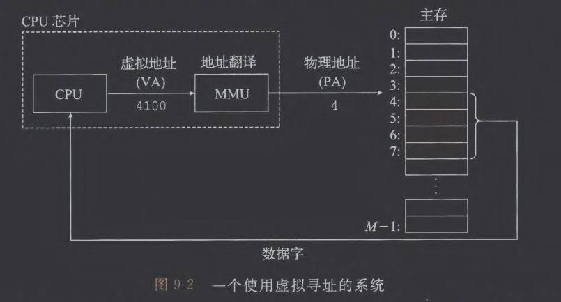

CPU通过生成一个虚拟地址(Virtual Address, VA)来访问主存，该虚拟地址通过内存管理单元(MMU)转换为物理地址。MMU利用存放在主存中的查询表来动态翻译虚拟地址，该表由操作系统维护。
# 2. 地址空间

- CPU 从一个有$N=2^n$个地址的地址空间中生成虚拟地址，这个地址空间称为虚拟地址空间:$\{0,1,2,\cdots,N-1\}$
- 物理地址空间对应于系统的$M$个字节：$\{0,1,2,\cdots,M-1\}$
# 3. 用于缓存

系统将虚拟内存分割为称为虚拟页(Virtual Page)的大小固定的块，每个虚拟页的大小为$P=2^p$字节。类似地，物理内存也被分割为大小为$P$字节的物理页(Physical Page)，称为页帧。

>虚拟内存将主存(RAM)看作是磁盘的缓存。

虚拟页分为以下三种：
1. 未分配的：没有任何数据与它们相关联，不占用任何空间。
2. 缓存的：磁盘上有它的内容，同时也在主存中。
3. 未缓存的：磁盘里有数据，但没有在RAM中，一旦访问就会触发缺页，需要OS将数据从磁盘调入主存。
## (1) DRAM缓存的组织结构

SRAM表示CPU和主存之间的$L_1,L_2,L_3$高速缓存，此时主存是被缓存对象。DRAM表示虚拟内存系统中的缓存，此时磁盘是被缓存对象。

由于DRAM缓存中的不命中比SRAM中的不命中要昂贵的多，所以虚拟页一般很大。同时DRAM缓存是全相联的，即任何虚拟页都可以放置在任何物理页中。
## (2) 页表

页表(page table)用于将虚拟页映射到物理页，被存放在物理内存中。页表可以看作是一个页表条目(Page Table Entry, PTE)的数组。虚拟地址空间中的每个页在页表中的一个固定偏移量处都有一个PTE。

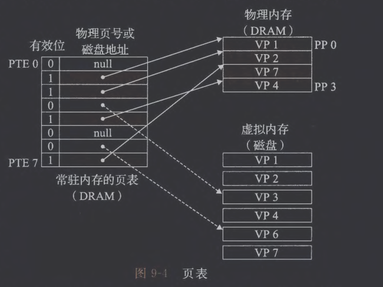

假设每个PTE是由一个有效位(valid bit)和一个$n$位地址字段组成的。有效位标识该虚拟页是否被缓存到DRAM中。
- 若设置了有效位，则地址字段标识DRAM中相应的物理页的起始位置
- 有效位为0时，空地址标识该虚拟页还未被分配，否则地址指向该虚拟页在磁盘上的起始位置。
## (3) 页命中

读取被缓存到DRAM中的数据流程：
1. CPU发出虚拟地址，由“虚拟页号+页内偏移”构成
2. MMU根据虚拟页号查找PTE
3. 物理地址 = 页帧号 + 页内偏移
4. 从DRAM中读数据
# 4. 用于内存管理

操作系统为每个进程提供了一个独立的页表，也就是每个进程都有独立的虚拟地址空间。多个虚拟页面可以映射到同一个共享物理页面上。

1. 简化链接：每个进程的内存使用情况保持一致性，比如栈占据用户进程地址空间最高的部分并向下生长。
2. 简化加载：当程序执行时，可执行文件包括`.text .data`等，Linux不会将其直接读入内存，加载器只会给该进程的虚拟地址空间里划分出一段空间并建立页表，但有效位置0。
3. 简化共享：将不同进程中适当的虚拟页面映射到相同的物理页面，从而安排多个进程共享这部分代码的一个副本
4. 简化内存分配：当调用`malloc`分配$k$个连续内存空间时，其在物理地址上的映射不一定是连续的。
# 5. 用于内存保护

- 每个PTE保存一组控制位，包括V(Valid bit), R(Read), W(Write), SUP。
- 内核模式不同于`root`，可以访问物理内存的任何部分，也可以修改页表。

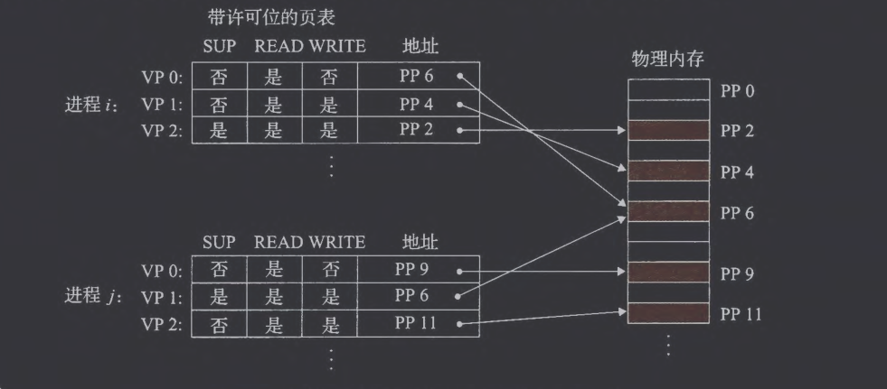

- 如果某一条指令违反了这些控制位，就会触发段错误(`Segmentation fault`)
# 6. 地址翻译


- CPU中的页表基址寄存器指向当前页表，会随上下文切换改变。
## (1) 结合高速缓存和虚拟内存

- 大多数系统选择采用物理地址访问SRAM高速缓存。
- 地址翻译发生在高速缓存查找前。
## (2) 使用TLB加速地址翻译

TLB(Translation Lookaside Buffer) 是一个虚拟寻址的缓存，每一行都保存着一个由单个PTE组成的块。

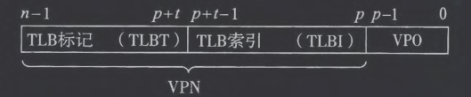

这里假设TLB有$T=2^t$个组。TLB索引由VPN的低$t$位组成，TLB标记即缓存中的`tag`。这里可以看作TLB是关于PTE的缓存。
## (3) 多级页表

考虑这一情形：虚拟内存的前2k个页面分配给了代码和数据，而后6k个页面未分配，再接下来的1023个页面也未分配，接下来的一个页面分配给用户栈，则一个二级的页表层次结构如下：

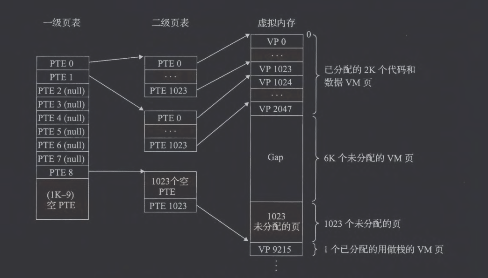

- 如果一级页表的PLE为null，那么对应的二级页表不会存在。
- 只有一级页表保持在主存中，二级页表等只有需要时才调入主存。

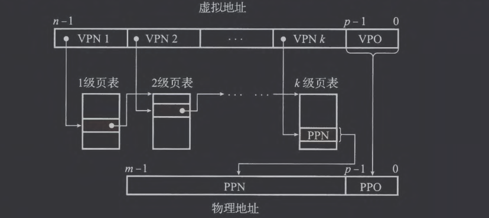

- VPN 在页表里被拆成`VPN1, VPN2, ..., VPNk`，逐级查表。
- VPN 在TLB里被拆成`(tag, index)`，像 cache 一样快速比对。
- 它们不会冲突，因为要么用 TLB，要么用页表。
- “快速访问 k 个 PTE”是指TLB 命中后，就不用查这 k 个 PTE，等价于一次内存访问顶掉了 k 次
## (4) 综合：端到端的地址翻译

考虑这样一个小型系统：
1. 内存访问是针对一字节的字的
2. 虚拟地址14位，物理地址12位
3. 页面大小为64字节
4. TLB为四路组相联，总共16个条目
5. L1高速缓存是物理寻址、直接映射的，行大小为4字节，共有16组

根据上述表述，该系统中的虚拟地址和物理地址格式如下：

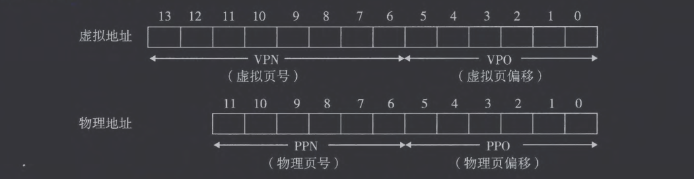

考虑TLB的格式：由于TLB有4个组，所以VPN的低2位用作组索引(TLBI)，剩余6位用作标记(TLBT)。则TLB的格式以及对应的虚拟地址的划分如下：


考虑页表的格式：页表为单级设计，一共有$2^8=256$个条目(PTE)。为便于理解，这里用索引它的VPN唯一标识一个PTE。

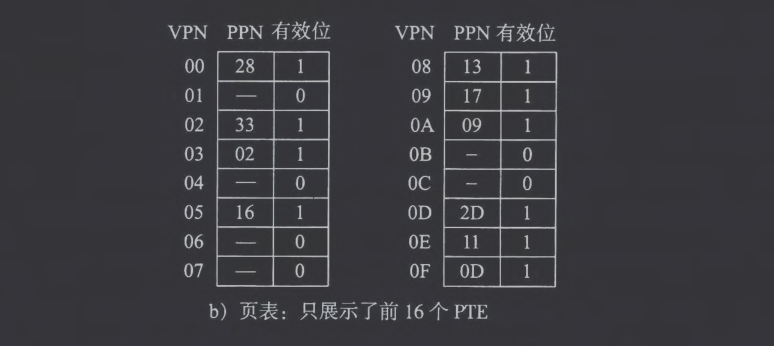

最后考虑高速缓存的格式：直接映射的缓存是通过物理地址中的字段来寻址的 。因为每个块都是4字节，所以物理地址的低 2 位作为块偏移(CO) 。因为有16 组，所以接下来的4位就用来表示组索引(CCI)。剩下的6位作为标记(CT)。

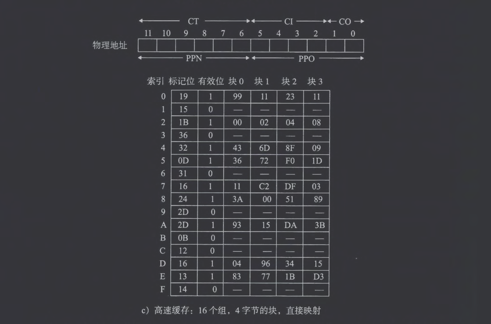

给定这样的初始化设定后，考虑CPU执行一条读地址`0x03d4`处字节的加载指令。首先我们拆解出虚拟地址的各个位如下：

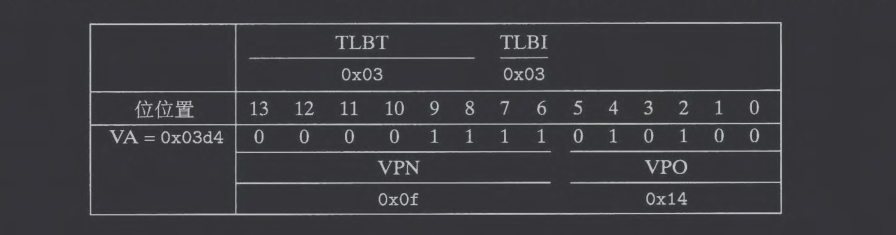

首先MMU从虚拟地址中抽取出VPN(`0x0f`)并检查TLB。TLB从VPN中抽取TLBT(`0x03`)和TLBI(`0x03`)，由上图可以发现，组`0x3`的第二个条目命中，而后将缓存的PPN(`0x0d`)返回给MMU。如果TLB不命中，MMU就需要从主存中取出相应的PTE。


将PPN(`0x0d`)和VPO(`0x14`)连接起来组成物理地址`0x354`。接下来MMU将物理地址发送给缓存，缓存从物理地址中抽取出缓存偏移CO(`0x0`) 、缓存组索引 CI(`0x5`) 以及缓存标记CT(`0x0D`)。

由于组`0x5`中的标记与CT一致，检测到命中，读取出在偏移量CO处的数据字节(`0x36`)并返回给MMU，随后MMU将其返回给CPU。
# 7. Intel Core i7/Linux 内存系统

## (1) Core i7地址翻译

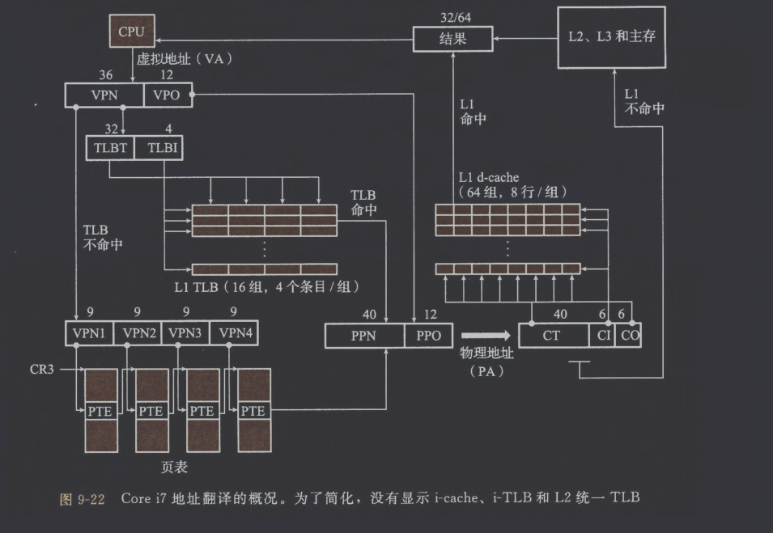

在实际的系统中，PTE有3个权限位：
- R/W位确定页的内容是可读写还是只读的
- U/S位确定能否在用户模式访问该页
- XD为禁止执行位，用于禁止从某些内存页读取指令，防止缓冲区溢出攻击

每次访问一个页时，MMU会设置A位，称为引用位(reference bit)，内核使用这个引用位实现页替换算法。每次对一个页进行写后，MMU会设置D位，称为修改位(dirty bit)，用于告知内核在复制替换页之前是否必须写回牺牲页。
## (2) Linux虚拟内存系统

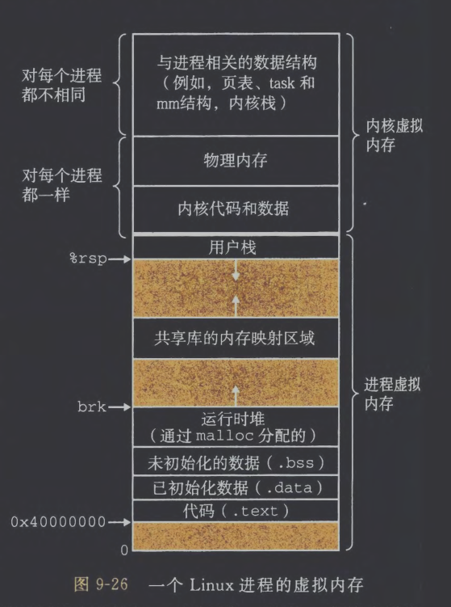

Linux为每个进程维护了一个单独的虚拟地址空间，形式如上图所示：
- 内核虚拟内存位于用户栈之上，包含内核中的代码和数据结构
- 内核虚拟内存的某些区域被映射到所有进程共享的物理页面
- 其他区域包含每个进程都不相同的数据如页表、内核在进程的上下文中执行代码时使用的栈等

Linux将虚拟内存组织成一些区域（段）的集合。代码段、数据段、堆、共享库段、用户栈都位于不同的区域。

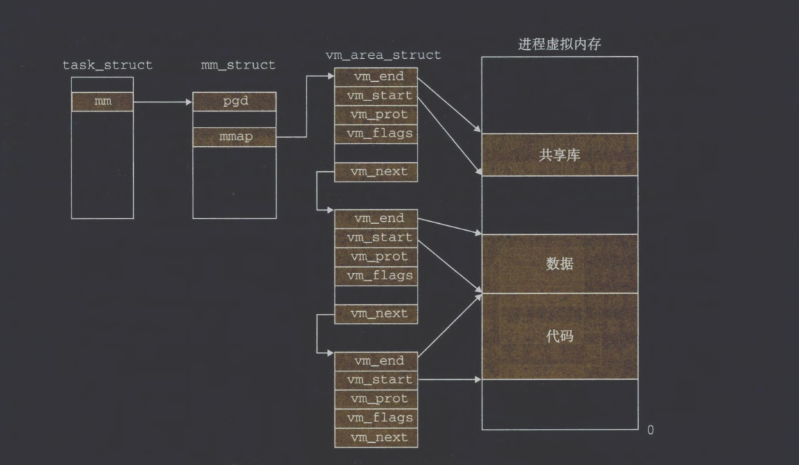

内核为系统中的每个进程维护一个单独的任务结构`task_struct`，任务结构中的元素包含或者指向内核运行该进程所需要的所有信息（PID、栈指针等）。

任务结构的一个条目指向`mm_struct`描述虚拟内存的当前状态，其中`pgd`字段指向第一级页表的基址，`mmap`指向`vm_area_struct`的链表，链表中的每个节点都描述了当前虚拟内存空间的一个区域。
- `vm_start`：区域起始
- `vm_end`：区域结束
- `vm_prot`：该区域内包含的所有页的读写许可权限
- `vm_flags`：该区域内的页面是与其他进程共享的还是私有的
- `vm_next`：指向链表中下一个区域结构

当MMU试图翻译某个虚拟地址A时触发缺页，处理程序随后执行如下步骤：
1. 判断虚拟地址A是否合法：搜索区域结构链表并与`vm_start`和`vm_end`作比较，若地址不合法则触发段错误终止进程。
2. 判断内存访问是否合法：判断进程是否有读、写或执行该区域内页面的权限，若不合法则触发保护异常终止进程。
3. 选择牺牲页面并重启引起缺页的指令。
# 8. 内存映射
## (1) 再看共享对象

- 当对象被映射为共享对象时，多个进程的虚拟地址空间可以同时指向同一个物理内存副本。此时任意进程对共享区域的写操作，都会立即对其他进程可见，并且修改内容会同步回磁盘上的原始对象。
- 私有对象的初始映射：
	- 不同进程映射到不同的虚拟地址，但它们的页表条目(PTE)都指向同一个物理页。这些 PTE 被标记为只读(read-only)，并且在内核的区域描述结构里标记成“写时复制(COW)”。
	- 如果某个进程尝试写这个页，由于PTE标记为只读，硬件会触发保护异常 (protection fault)。内核的缺页/异常处理程序捕获到这个异常后，会识别这是由于COW 区域写入导致的。
	- 处理步骤：
		1. 在物理内存中新建一个该页的副本。
		2. 把当前进程的 PTE 更新为指向这个新的物理页。
		3. 把 PTE 的权限改为可写。
## (2) 再看fork函数

- fork的初始化 ：
	- 内核会为子进程创建必要的内核数据结构，并分配一个新的 PID。
	- 此时它会把父进程的内存描述符（`mm_struct`）、区域结构（`vm_area_struct`）、页表等复制一份。
- 写时复制的作用：  
	- 父子进程最初共享同一份物理内存，页表被标记为只读，并且区域被标记为 COW。这样子进程的虚拟地址空间和父进程一模一样，但不会产生额外内存开销。
	- 当任意一方写入某个页时，硬件触发保护异常，内核复制该页并更新页表，让进程拥有属于自己的物理页。
## (3) 再看execve函数

`execve`函数在当前进程中加载并运行包含在可执行目标文件`a.out`中的程序。加载并运行`a.out`有如下步骤：
1. 删除已存在的用户区域
2. 映射私有区域：为新程序的代码、数据、bss和栈区域创建新的区域结构
3. 映射共享区域：内核通过动态链接器把共享对象映射到进程的虚拟空间
4. 设置程序计数器（PC）
## (4) 使用mmap函数的用户级内存映射

```C
#include <unistd .h>
#include <sys/mman.h>
void *mmap(void *start, size_t length, int prot, int flags, int fd, off_t offset);
//返回：若成功时则为指向映射区域的指针，若出错则为 MAP_FAILED(-1) 。
bufp = Mmap(NULL, size, PROT_READ, MAP_PRIVATE | MAP_ANON, 0, 0);

int munmap(void *start, size_t length);
//返回：若成功则为0,若出错则为一 1 。
```

`mmap`函数的作用是将文件（或一块匿名空间）直接映射到进程的虚拟内存中，保证文件的内容和内存里的某段地址空间绑定在一起，不需要显式地调用`read`或者`write`。
- `start`：建议的起始内存地址，通常为NULL，内核自主选择合适的地址
- `length`：要映射的字节数，按页大小向上取整
- `prot`：包括`PROT_READ`（可读）,`PROT_WRITE`（可写）,`PROT_EXEC`（可执行）,`PROT_NONE`（不可访问）
- `flags`：控制这个映射的行为
	- `MAP_PRIVATE`：私有写时复制 (COW) 映射   
	- `MAP_SHARED`：多个进程共享同一份物理内存，写入会反映到文件
	- `MAP_ANONYMOUS`：不依赖文件，直接分配匿名页（常用于分配堆或栈）
- `fd`：文件描述符，指向要映射的对象
- `offset`：从文件的什么位置开始映射

`munmap`函数用于删除虚拟内存的区域。
# 9. 动态内存分配

假设堆是一个请求二进制零的区域并向上生长，内核维护变量`brk`指向堆顶。

分配器可以分为显式和隐式两种：
- C提供的`malloc`函数就是显式
- 隐式分配器也称为垃圾收集器，用于自动释放未使用的已分配的块。
## (1) malloc和free函数

```C
#include <stdlib.h>
void *malloc(size_t size);
//返回：若成功则为己分配块的指针，若出错则为 NULL。
void free(void *ptr);
```
`malloc`函数返回一个指向大小为至少`size`字节的内存块的指针，但不进行初始化。如果`malloc`遇到问题（程序要求的内存块比可用的虚拟内存还要大），则返回`NULL`并设置`errno`。

`calloc`会将分配的内存初始化为0，`realloc`会改变以前已分配块的大小。

```C
#include <unistd.h>
void *sbrk(intptr_t incr);
//返回：若成功则为旧的brk 指针，若出错则为-1.
```
`sbrk`函数通过将内核的`brk`指针增加`incr`来扩展和收缩堆。如果成功，它就返回`brk`的旧值，否则，它就返回 -1,并将`errno`设置为`ENOMEM`。如果`incr`为零，那么`sbrk`就返回`brk`的当前值。这里`incr`可以为负。
## (2) 为什么要使用动态内存分配
## (3) 分配器的要求和目标

性能目标：
- 最大化吞吐率：
	 吞吐率定义为每个单位时间内完成的请求数，可以通过使满足分配和释放请求的平均时间最小化来使吞吐率最大化。
- 最大化内存利用率：
	 给定$n$个分配和释放请求的某种顺序$$R_0, R_1,\cdots, R_k, \cdots, R_{n-1}$$如果一个应用程序请求一个$p$字节的块，那么得到的已分配块的有效载荷是$p$字节。在请求$R_k$完成之后，聚集有效栽荷表示为$P_k$，为当前已分配的块的有效载荷之和，而$H-k$表示堆的当前的（单调非递减的）大小。那么，前$k+1$个请求的峰值利用率，表示为$U_k$，可以通过下式得到：$$U_k = \frac{\max_{i\le k}P_i}{H_k}$$则分配器的目标就是使峰值利用率$U_k$最大化。
## (4) 碎片

- 内部碎片：用户请求的有效载荷(payload)比分配器实际分配的块小，可能由于分配器要求的最小块大小、对齐约束等。
- 外部碎片：空闲内存合计起来足够满足一个分配请求，但是没有一个单独的空闲块足够大。
## (5) 实现问题

- 如何记录空闲块
- 如何选择合适的空闲块放置新分配的块
- 将一个新分配的块放置到某个空闲块之后，如何处理空闲块中的剩余部分
- 如何处理一个刚被释放的块
## (6) 隐式空闲链表


一个块是由一个字的头部、有效载荷，以及可能的一些额外的填充组成的。头部编码了这个块的大小（包括头部和所有的填充），以及这个块是已分配的还是空闲的。

如果我们强加一个双字的对齐约束条件，那么块大小就总是8的倍数，且块大小的最低3位总是零。因此，我们只需要内存大小的29个高位，释放剩余的3位来编码其他信息。在这种情况中，我们用其中的最低位（已分配位）来指明这个块是已分配的还是空闲的。例如，假设我们有一个已分配的块，大小为 24(`0x18`) 字节。那么它的头部将是`0x00000018 | 0x1 = 0x00000019`。


## (7) 放置已分配的块

当应用请求一个$k$字节的块时，分配器搜索空闲链表，寻找一个合适的空闲块，分配器执行这种分配的方式是由放置策略决定的：
1. 首次适配：选择第一个合适的空闲块，但趋向于在链表起始处留下小空闲块的碎片，增大了对较大块的搜索时间。
2. 下一次适配：上一次在某个空闲块里已经发现了一个匹配，那么很可能下一次我们也能在这个剩余块中发现匹配。缺点是内存利用率很低。
3. 最佳适配：检查每个空闲块，选择适合所需请求大小的最小空闲块。
## (8) 分配空闲块

一旦找到合适的空闲块，分配器决定使用整个空闲块，或者将空闲块分为两部分：一部分变成分配块，另一部分变成新的空闲块。
## (9) 获取额外的堆内存

分配器通过调用`sbrk`函数向内核请求额外的堆内存，分配器将额外的内存转化成一个新的内存块并插入到空闲链表中。
## (10) 合并空闲块

合并包含一种策略决定：
1. 立即合并：每当一个块被释放就合并所有相邻块
2. 推迟合并：直到某个分配请求失败才会扫描整个堆并合并所有空闲块
## (11) 带边界标记的合并

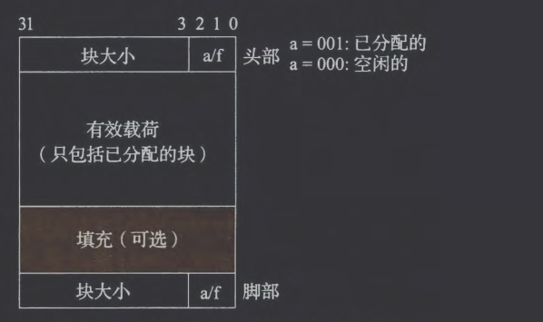

脚部保存着头部的一个副本，分配器通过检查脚部判断前面一个块的起始位置和状态，脚部总是在距当前块开始位置一个字的距离。

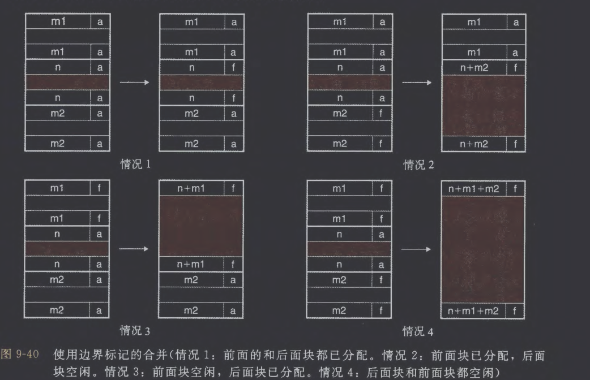

优化思路：将前面块的已分配/空闲位存放在当前块中多出来的低位中，那么已分配的块就不需要脚部了，则此空间可以作为有效载荷。当`free`掉前面的块时，当前块的头部需要同步更新它的prev_alloc位。
## (12) 综合：实现一个简单的分配器

代码实现在`CMU-15213\CodeDemo\vm\malloc\mm.c`中

`mm_init`(Line66)：
- 放置对齐填充 + prologue header/footer + epilogue header
- 把`heap_listp`指向序言块的“payload 指针”位置
- 然后`extend_heap(CHUNKSIZE/WSIZE)`为堆分配第一个大的空闲块

基本常数和宏(Line19)：
- `PACK`宏将大小和已分配位结合起来并返回一个值
- `GET`宏读取和返回参数`p`引用的字
- `GET_SIZE`和`GET_ALLOC`宏从地址`p`处的头部或者脚部分别返回大小和已分配位
- 给定一个块指针`bp`，`HDRP`和`FTRP`宏分别返回指向块头部和脚部的指针
- `NEXT_BLKP`和`PREV_BLKP`宏分别返回指向后面的块和前面的块的块指针

`extend_heap`(Line253)：
- 调用环境：
	- 堆被初始化时
	- 当`mm_malloc`不能找到合适的匹配块时
- `mem_sbrk`返回的新内存，正好是旧epilogue header后面的空间
- 在扩展出来的空间尾部，重新放置一个新的epilogue header
- 由于可能出现前一个堆以一个空闲块结尾的情况，所以最后调用`coalesce`合并两个空闲块，并返回指向合并后的块的块指针

`mm_free`和`coalesce`(Line134)：
- 我们选择的空闲链表格式（它的序言块和结尾块总是标记为已分配）允许我们忽略潜在的麻烦边界情况，也就是，请求块`bp`在堆的起始处或者是在堆的结尾处。

`mm_malloc`(Line94)：
- 在检查完请求的真假之后，分配器必须调整请求块的大小，从而为头部和脚部留有空间，并满足双字对齐的要求
- 一旦分配器调整了请求的大小，它就会搜索空闲链表，寻找一个合适的空闲块。如果有合适的，那么分配器就放置这个请求块，并可选地分割出多余的部分，然后返回新分配块的地址。
- 如果分配器不能够发现一 个匹配的块，那么就用一个新的空闲块来扩展堆，把请求块放置在这个新的空闲块里，可选地分割这个块，然后返回一个指针，指向这个新分配的块 。
## (13) 显式空闲链表

将堆组织成一个双向空闲链表，在每个空闲块中，都包含一个pred（前驱）
和succ（后继）指针。

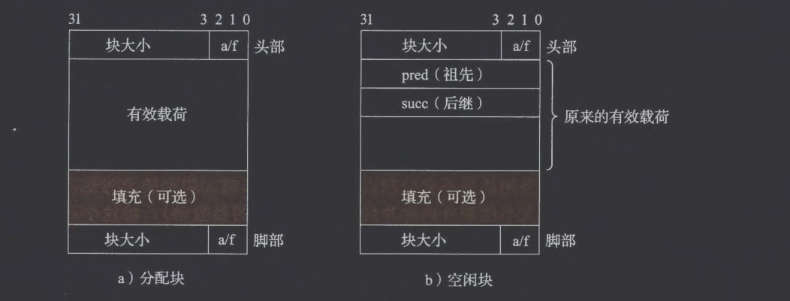

- 按照LIFO顺序维护链表：将最新释放的块放置在链表的开始处
- 按照地址顺序：有更好的内存利用率
## (14) 分离的空闲链表

可以采用分离存储，即维护多个空闲链表，其中每个链表中的块有大致相等的大小。当分配器需要一个大小为$n$的块时，它就搜索相应的空闲链表。如果不能找到合适的块与之匹配，它就搜索下一个链表，以此类推。

1. 简单分离存储：
	- 每个大小类的空闲链表包含大小相等的块，每个块的大小就是这个大小类中最大元素的大小
	- 链表非空：分配其中第一块的全部
	- 链表为空：向操作系统请求一个固定大小的额外内存片，将这个片分成大小相等的块，并将这些块链接起来形成新的空闲链表
2. 分离适配：
	- 维护多个空闲链表来管理不同大小范围的块，每个链表对应一个大小类
	- 当分配请求到来时，分配器先确定请求所属的大小类，在对应的链表中进行首次适配搜索
		- 如果找到合适的块则直接使用或分割
		- 若找不到则继续查找更大类的链表，仍未命中则向系统请求新内存
	- 释放时，先尝试与相邻空闲块合并，再将合并后的块插入到合适的大小类链表中
3. 伙伴系统：
	- 每个大小类都是2的幂
	- 假设一个堆的大小为$2^m$个字，我们为每个$2^k$大小维护一个分离空闲链表，其中$0\le k\le m$，请求块大小向上舍入到最接近的2的幂，最开始时，只有一个大小为$2^m$个字的空闲块
	- 为了分配一个大小为$2^k$的块，我们找到第一个可用的、大小为$2^j$的块，其中$k\le j\le m$。如果$j = k$，那么分配完成
	- 否则，我们递归地将该块二分，直到得到大小为$2^k$的块
	- 在分割过程中，每个剩下的半块（称为“伙伴”）会被放入相应的空闲链表中。  当释放一个大小为$2^k$的块时，我们会不断尝试与它的伙伴进行合并。  一旦遇到一个已分配的伙伴，就停止合并
# 10. 垃圾收集
## (1) 垃圾收集器的基本知识
## (2) Mark&Sweep垃圾收集器

由标记阶段和清除阶段组成，标记阶段标记出根节点的所有可达的和已分配的后继，而后面的清除阶段释放每个未被标记的已分配块。块头部中空闲的低位中的一位用于表示该块是否被标记。

根节点的判定：正在被调用的栈帧中的局部参数、类的静态变量等

代码实现如下：
```C
void mark(ptr p) {
    if ((b = isPtr(p)) == NULL)  // 判断 p 是否是指向堆块的指针
        return;
    if (blockMarked(b))          // 如果该块已被标记，则返回
        return;
    markBlock(b);                // 标记该块为已访问
    len = length(b);             // 获取块的大小（比如数组或对象字段数）
    for (i=0; i < len; i++)
        mark(b[i]);              // 递归标记块中每个指针字段
    return;
}

void sweep(ptr b, ptr end) {
    while (b < end) {
        if (blockMarked(b))
            unmarkBlock(b);      // 清除标记，为下一轮 GC 准备
        else if (blockAllocated(b))
            free(b);             // 释放未标记的块（垃圾）
        b = nextBlock(b);        // 移到下一个内存块
    }
    return;
}
```
## (3) C程序的保守Mark& Sweep

在C语言中，`isPtr`函数的实现比较困难，因为C无法判断输入参数`p`是不是一个指针，同时也没有很好的方案去判断`p`是否指向一个已分配块的有效载荷中的某个位置。

解决方案是将已分配块集合维护成一棵平衡二叉树，左子树的所有块存放于较小的地址处，右子树的块存放于较大的地址处。每个已分配块的头部有两个附加字段：`left`和`right`，每个字段指向某个已分配块的头部。
 
`isPtr`函数的工作方式：当`isPtr(p)`被调用时（`p`是待检查的值），它在这棵平衡二叉树中进行二分查找。
    1. 从根节点开始。
    2. 检查`p`是否落在当前节点的地址范围内（即当前块起始地址 <= p < 当前块起始地址 + 块大小）。
    3. 如果是，则判断`p`是一个指向有效载荷的指针，函数返回真。
    4. 如果不是，则根据`p`的值与当前节点块地址的大小关系，决定是搜索左子树（`p`更小）还是右子树（`p`更大）。
    5. 如果搜索完整棵树都未找到包含`p`的块，则判断`p`不是有效指针。
# 11. C程序中常见的与内存相关的错误
## (1) 间接引用坏指针

正确做法为`scanf("%d", &val)`，如果写成`scanf("%d", val)`，`scanf`就会将`val`解释为地址并试图写，如果该区域恰好合法，那么就会直接覆盖这段内存对其他程序产生影响。
## (2) 读未初始化的内存
## (3) 允许栈缓冲区溢出

参考第二章程序的机器级表示中10.2小节
## (4) 假设指针和它们指向的对象是相同大小的

错误示例：
```C
int **makeArray1(int n, int m)
{
	int i;
	int **A= (int **)Malloc(n * sizeof(int));
	for (i = O; i < n; i++)
	A[i] = (int *)Malloc(m * sizeof(int));
	return A;
}
```
## (5) 造成错位错误
## (6) 引用指针，而不是它所指向的对象

应该写成`(*size)--`而不是`*size-- `如果想对`size`指向的对象自减而不是`size`这个指针，因为`*`和`--`的优先级相同，遵循从右向左结合。
## (7) 误解指针运算
## (8) 引用不存在的变量
## (9) 引用空闲堆块中的数据
## (10) 引起内存泄漏
# 12. 小结
