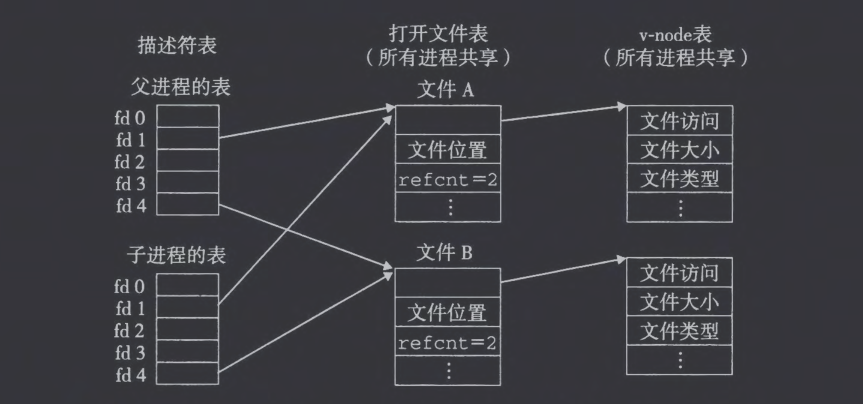

# 1. Unix I/O

- Linux shell创建的每个进程都默认打开stdin, stdout, stderr，文件描述符为0，1，2。头文件\<unistd.h\>定义了`STDIN_FILENO`, `STDOUT_FILENO`, `STDERR_FILENO`宏显式替代描述符。
- 对于每个打开的文件，内核保持着一个文件位置k，初始为0 。这个文件位置是从文件开头起始的字节偏移量。
- 一个读操作就是从文件复制$n\gt 0$个字节到内存，从当前文件位置$k$开始，然后将$k$增加到$k+n$。给定一个大小为$m$字节的文件，当$k\le m$时执行读操作会触发一个称为 end-of-file(EOF) 的条件。
# 2. 文件
# 3. 打开和关闭文件

```C
#include <sys/types.h>
#include <sys/stat.h>
#include <fcntl .h>

//返回：若成功则为新文件描述符，若出错为-1 。
int open(char *filename, int flags, mode_t mode);
```

- flags可以取如下的值：

| 取值       | 含义                       |
| -------- | ------------------------ |
| O_RDONLY | 只读                       |
| O_WRONLY | 只写                       |
| O_RDWR   | 可读可写                     |
| O_CREAT  | 如果文件不存在 ，就创建它的一个截断的（空）文件 |
| O_TRUNC  | 如果文件巳经存在，就截断它            |
| O_APPEND | 在每次写操作前，设置文件位置到文件的结尾处    |
- mode指定新文件的访问权限位。作为上下文的一部分，每个进程都有一个 umask。当进程通过带某个 mode 参数的 open 函数调用来创建一个新文件时，文件的访问权限位被设置为 mode & ~ umask 
# 4. 读和写文件

```C
#include <unistd.h>

//返回：若成功则为读的字节数，若EOF则为0，若出错为-1。
ssize_t read(int fd, void *buf, size_t n);
//返回：若成功则为写的字节数，若出错则为-1。
ssize_t write(int fd, const void *buf, size_t n);
```

- read 函数从描述符为fd的当前文件位置复制最多n个字节到内存位置buf。返回值-1表示一个错误，而返回值0表示EOF。否则，返回值表示的是实际传送的字节数量。
- write 函数从内存位置buf复制至多n个字节到描述符fd的当前文件位置。
# 5. 用RIO包健壮地读写

## (1) RIO的无缓冲的输入输出函数

```C
#include "csapp.h"

//返回：若成功则为传送的宇节数，若EOF则为0 ，若出错则为-1。
ssize_t rio_readn(int fd, void *usrbuf, size_t n);
ssize_t rio_writen(int fd, void *usrbuf, size_t n);
```

- rio_readn 函数从描述符fd的当前文件位置最多传送n个字节到内存位置 usrbuf。rio_writen 函数从位置usrbuf传送n个字节到描述符fd 
## (2) RIO的带缓冲的输入输出函数

```C
#include "csapp.h"

void rio_readinitb(rio_t *rp, int fd);

//返回：若成功则为读的字节数，若 EOF 则为0,若出错则为-1。
ssize_t rio_readlineb(rio_t *rp, void *usrbuf, size_t maxlen);
ssize_t rio_readnb(rio_t *rp, void *usrbuf, size_t n);
```

- 每打开一个描述符，都会调用一次 rio_readinitb 函数。它将描述符 fd 和地址 rp 处的一个类型为 rio_t 的读缓冲区联系起来。
- rio_readlineb从一个内部读缓冲区复制一个文本行，当缓冲区变空时，会自动地调用 read 重新填满缓冲区
- rio_readnb用于既包含文本行也包含二进制数据的文件（HTTP响应）

```C
#include "csapp.h"
int main(int argc, char **argv)
{
	int n;
	rio_t rio;
	char buf[MAXLINE];
	
	Rio_readinitb(&rio, STDIN_FILENO);
	//使用 RIO 函数来一次一行地从标准输入复制一个文本文件到标准输出。
	while ((n = Rio_readlineb (&rio, buf, MAXLINE) != 0)
		Rio_writen(STDOUT_FILENO, buf, n);
}
```

- RIO一次性使用 read 桶装大量内容放入rio_buf
- 用户多次读小块内容时就直接从用户态缓冲区里拿，不再访问内核

```C
typedef struct {
    int rio_fd;                 // 对应的文件描述符
    int rio_cnt;                // 缓冲区中剩余未读的字节数
    char *rio_bufptr;           // 下次读取的位置
    char rio_buf[RIO_BUFSIZE];  // 实际的缓冲区
} rio_t;

static ssize_t rio_read(rio_t *rp, char *usrbuf, size_t n)
{
    int cnt;
    /* 若内部缓冲区为空，则循环填充 */
    while (rp->rio_cnt <= 0) {
        rp->rio_cnt = read(rp->rio_fd, rp->rio_buf, sizeof(rp->rio_buf));
        if (rp->rio_cnt < 0) {
            /* 如果不是被信号打断，则出错返回 */
            if (errno != EINTR)
                return -1;
            /* 若是 EINTR，则继续再次 read */
        }
        else if (rp->rio_cnt == 0) {
            /* EOF */
            return 0;
        }
        else {
            /* 正常读取到数据，重置 buffer pointer */
            rp->rio_bufptr = rp->rio_buf;
        }
    }
    /* 从内部缓冲区拷贝 min(n, rp->rio_cnt) 字节 */
    cnt = n;
    if ((size_t)rp->rio_cnt < n)
        cnt = rp->rio_cnt;
    memcpy(usrbuf, rp->rio_bufptr, cnt);
    rp->rio_bufptr += cnt;
    rp->rio_cnt -= cnt;
    return cnt;
}
```
# 6. 读取文件元数据

```C
#include <unistd.h>
#include <sys/stat.h>

//返回：若成功则为0，若出错则为-1。
int stat(const char *filename, struct stat *buf);
int fstat(int fd, struct stat *buf);
```

stat和fstat以文件名或文件描述符作为输入，填写stat数据结构的各个成员。

```C
struct stat {
    dev_t     st_dev;     /* 所在设备号 */
    ino_t     st_ino;     /* inode 节点号 */
    mode_t    st_mode;    /* 文件类型 + 权限 */
    nlink_t   st_nlink;   /* 硬链接数 */
    uid_t     st_uid;     /* 所有者 UID */
    gid_t     st_gid;     /* 所有者 GID */
    dev_t     st_rdev;    /* 设备文件的设备号 */
    off_t     st_size;    /* 文件大小（字节数） */
    blksize_t st_blksize; /* 最优 I/O 块大小 */
    blkcnt_t  st_blocks;  /* 占用磁盘块数 */
    struct timespec st_atim; /* 最后访问时间 */
    struct timespec st_mtim; /* 最后修改时间 */
    struct timespec st_ctim; /* inode 变更时间 */
};
```
# 7. 读取目录内容

```C
#include <sys/types.h>
#fnclude <dirent.h>

struct dirent {
    ino_t d_ino;          // inode number
    char  d_name[256];    // 文件名
};

//返回：若成功，则为处理的指针，若出错，则为 NULL 
DIR *opendir(const char *name);
//若成功，则返回指向下一个目录项的指针；若没有更多的目录项或出错，则为 NULL 
struct dirent *readdir(DIR *dirp);
//返回：成功为0，错误为-1 。
int closedir(DIR *dirp);
```
# 8. 共享文件

内核用三个相关的数据结构来表示打开的文件：
- 进程的描述符表是每个进程独有的，记录 fd 到文件表项的映射；
- 文件表是系统共享的，每个表项保存当前文件偏移量、引用计数以及指向  v-node 的指针；
- v-node 表也是系统共享的，每个表项保存文件的元数据，如类型和大小。

- 进程通过描述符表找到对应的文件表项，从而确定文件偏移量与访问状态，再由文件表项指向 v-node 获取文件真实的元数据。
- 多次 open 会产生不同文件表项，偏移量各自独立；
- dup 或 fork 会让多个 fd 指向同一个文件表项，共享偏移量；只有引用计数归零时文件表项才会被删除，而 v-node 作为文件本体的元数据始终可被多个文件表项共享。
# 9. I-O重定向

```shell
linux> ls > foo.txt
```
使得 shell 加载和执行 ls 程序，将标准输出重定向到磁盘文件 foo.txt。

```C
#include <unistd.h>
//返回：若成功则为非负的描述符，若出错则为-1。
int dup2(int oldfd, int newfd);
```

dup2 函数复制描述符表表项 oldfd 到描述符表表项 newfd,覆盖描述符表表项 new­fd 以前的内容。如果 newfd 已经打开了，dup2 会在复制 oldfd 之前关闭 newfd 。
# 10. 标准I-O
# 11. 使用I-O函数
# 12. 小结

这章内容实在是少，而且本人也做完了NJU ics课程的pa3，再回来阅读这章内容也就更加轻松，2025.11.1 2h速通，下午开下一章。