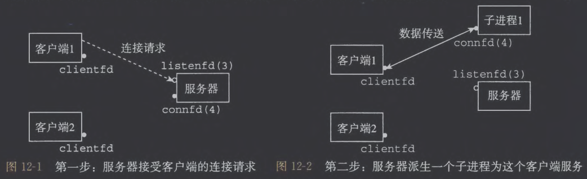
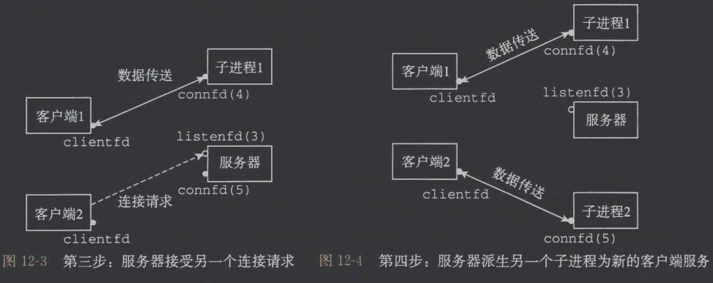
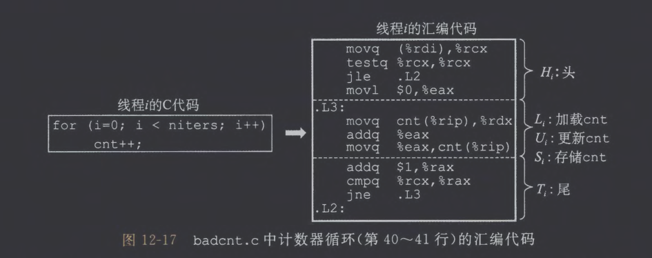
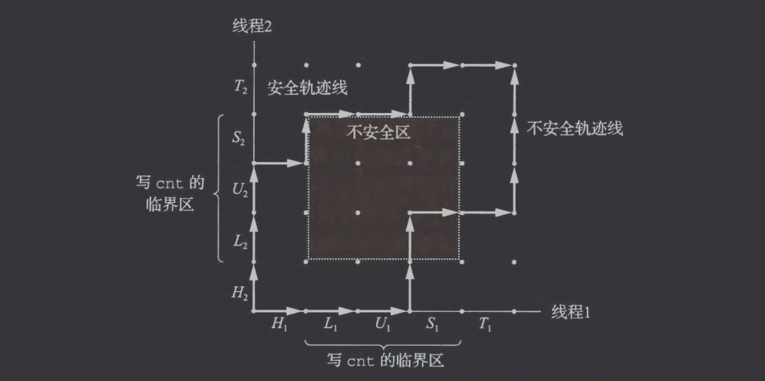
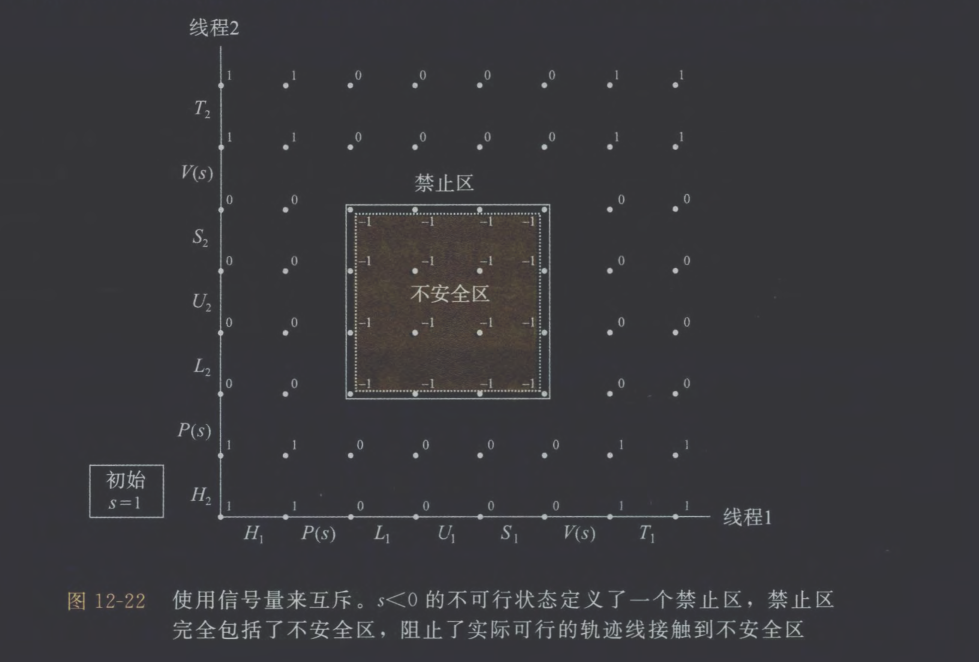
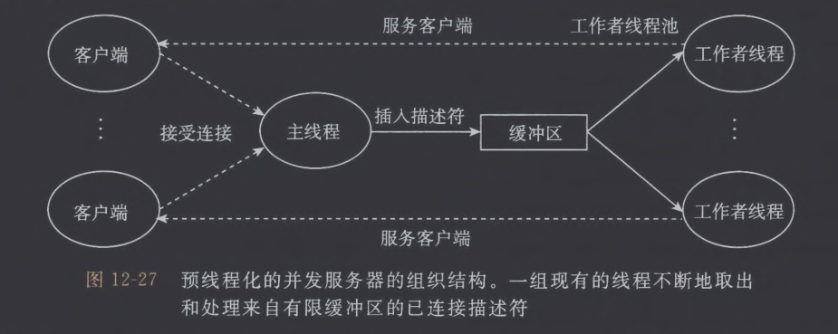
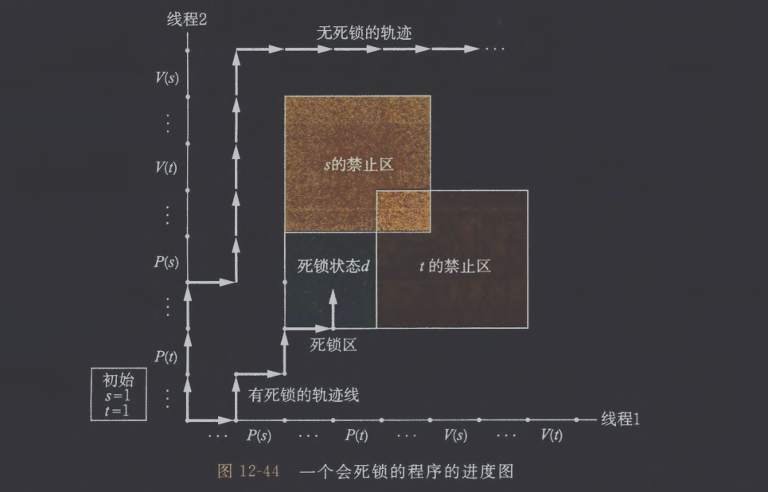

# 1. 基于进程的并发编程

考虑在父进程中接受客户端连接请求，然后创建一个新的子进程来为每个新客户端提供服务。假设存在两个客户端和一个服务器，服务器正在监听一个监听描述符（3）上的连接请求。

1. 服务器接受了客户端的连接请求，返回一个已连接描述符（4）
2. 服务器派生一个子进程1，子进程关闭其副本中的监听描述符（3），父进程关闭它的已连接描述符（4）

3. 父进程为客户端1创建了子进程之后，它接受一个新的客户端2的连接请求,并返回一个新的巳连接描述符（5）
4. 父进程派生另一个子进程2用已连接描述符（5）为它的客户端提供服务
5. 服务器等待下一个连接请求，两个子进程并发地为各自的客户端提供服务
## (1) 基于进程的并发服务器

```C
#include "csapp.h"

/* 子进程 SIGCHLD 信号处理程序
 * 目的：收割已经退出的子进程，避免产生僵尸进程（zombie）。
 * 使用 waitpid(-1, &status, WNOHANG) 在非阻塞模式下收集所有已退出子进程。
 */
void sigchld_handler(int sig) {
    /* 保存 errno，因为在信号处理函数中调用系统函数可能修改它 */
    int olderrno = errno;
    int status;
    /* 循环 waitpid，直到没有可收割的子进程（返回 0）或出错（返回 -1） */
    while (waitpid(-1, &status, WNOHANG) > 0)
        ; /* 什么也不做，循环只是为了收割所有已退出的子进程 */
    errno = olderrno;
    return;
}

/* echo 函数：用 rio 封装实现“回显”功能（读一行，写回去） */
void echo(int connfd) {
    size_t n;
    char buf[MAXLINE];
    rio_t rio;
    /* 初始化 rio 读缓存区，绑定到 connfd */
    Rio_readinitb(&rio, connfd);
    /* 逐行读取，直到 EOF（Rio_readlineb 返回 0 表示 EOF） */
    while ((n = Rio_readlineb(&rio, buf, MAXLINE)) != 0) {
        /* 将读到的数据原样写回给客户端 */
        Rio_writen(connfd, buf, n);
    }
}

/* main：监听 -> 循环 accept -> fork 子进程处理连接 */
int main(int argc, char **argv) {
    int listenfd, connfd;
    socklen_t clientlen;
    struct sockaddr_storage clientaddr; /* 通用的 sockaddr 存储结构 */
    if (argc != 2) {
        fprintf(stderr, "usage: %s <port>\n", argv[0]);
        exit(0);
    }
    //当子进程退出时，父进程会收到 SIGCHLD
    /* 捕获 SIGCHLD，以便父进程能收割死掉的孩子（防止产生僵尸进程） */
    Signal(SIGCHLD, sigchld_handler);
    // 打开监听套接字（csapp 封装，自动处理 getaddrinfo、socket、bind、listen） 
    listenfd = Open_listenfd(argv[1]);
    /* 服务主循环：不断 accept 新连接 */
    while (1) {
        clientlen = sizeof(struct sockaddr_storage);
        connfd = Accept(listenfd, (SA *)&clientaddr, &clientlen);
        /* fork 创建子进程处理该连接 */
        if (Fork() == 0) {       
            //子进程继承了 listening socket 的描述符，但子进程不负责监听，必须关闭 
            Close(listenfd);     
            /* 服务客户端：回显 */
            echo(connfd);    
            /* 服务完成后关闭连接描述符并退出（很重要） */
            Close(connfd);          
            exit(0);               
        }
        /* PARENT */
        /* 父进程不需要处理这个已连接套接字，必须关闭父进程中的副本 */
        Close(connfd);               /* Parent closes connected socket (important!) */
        /* 父进程回到循环继续 accept 新连接 */
    }
    /* 程序通常不会运行到这里 */
    return 0;
	}
```
## (2) 进程的优劣

- 进程共享文件状态，但不共享内存
- 提供强隔离性，但让共享状态和高性能并发变难。
# 2. 基于I-O多路复用的并发编程

假设服务器需要同时处理网络事件和用户从键盘输入的命令，那么下面两个函数调用都会阻塞I-O，直到有数据/事件发生。

```C
connfd = accept(listenfd, ...);
read(STDIN_FILENO, buf, ...);
```

基本的思路就是使用 select 函数，要求内核挂起进程，只有在一个或多个I-O事件发生后，才将控制返回给应用程序

```C
#include <sys/select.h>

//返回已准备好的描述符的非零的个数，若出错则为-1
int select(int n, fd_set *fdset, NULL, NULL, NULL);

//处理描述符集合的宏
FD_ZERO(fd_set•fdset);                     //Clear all bits in fdset
FD_CLR(int fd, fd_set•fdset);             //Clear bit fd in fdset
FD_SET(int fd, fd_set•fdset);            //Turn on bit fd in fdset
FD_ISSET(int fd, fd_set•fdset);        //Is bit fd in fdset on?
```
## (1) 并发事件驱动服务器

```C
#include "csapp.h"

typedef struct {
    int maxfd;                 // read_set 中最大的 fd
    fd_set read_set;           // 所有关注的 fd
    fd_set ready_set;          // 本次 select 返回的可读 fd
    int nready;                // 本次 select 返回的可读 fd 数量
    int maxi;                  // clientfd[] 的最大索引
    int clientfd[FD_SETSIZE];  // 已连接的客户端 fd，-1 表示空
    rio_t clientrio[FD_SETSIZE]; // 每个客户端独立的 RIO 缓冲区
} pool;

static pool p;
int byte_cnt = 0;              // 累计收到的字节总数

/* ---------------- init_pool ---------------- */
void init_pool(int listenfd, pool *p) {
    int i;
    // 当前还没有任何客户端
    p->maxi = -1;
    for (i = 0; i < FD_SETSIZE; i++)
        p->clientfd[i] = -1;
    // select 初始只关注 listenfd
    p->maxfd = listenfd;
    FD_ZERO(&p->read_set);
    FD_SET(listenfd, &p->read_set);
}

/* ---------------- add_client ---------------- */
void add_client(int connfd, pool *p) {
    int i;
    p->nready--;  // 减去处理 listenfd 的事件
    // 找一个空槽位存放新客户端
    for (i = 0; i < FD_SETSIZE; i++) {
        if (p->clientfd[i] < 0) {
            p->clientfd[i] = connfd;
            Rio_readinitb(&p->clientrio[i], connfd);
            // 加入 select 监听集合
            FD_SET(connfd, &p->read_set);
            // 更新 maxfd / maxi
            if (connfd > p->maxfd)
                p->maxfd = connfd;
            if (i > p->maxi)
                p->maxi = i;
            return;
        }
    }
    // 没找到位置
    app_error("add_client error: Too many clients");
}

/* ---------------- check_clients ---------------- */
void check_clients(pool *p) {
    int i, connfd, n;
    char buf[MAXLINE];
    rio_t rio;
    for (i = 0; i <= p->maxi && p->nready > 0; i++) {
        connfd = p->clientfd[i];
        rio = p->clientrio[i];
        if (connfd > 0 && FD_ISSET(connfd, &p->ready_set)) {
            p->nready--;
            // 尝试读一行数据（不会阻塞）
            if ((n = Rio_readlineb(&rio, buf, MAXLINE)) != 0) {
                byte_cnt += n;
                printf("Server received %d (%d total) bytes on fd %d\n",
                       n, byte_cnt, connfd);
                Rio_writen(connfd, buf, n);  // 回显给客户端
            }
            else {
                // EOF -> 客户端关闭连接
                Close(connfd);
                FD_CLR(connfd, &p->read_set);
                p->clientfd[i] = -1;
            }
        }
    }
}

/* ---------------- main ---------------- */
int main(int argc, char **argv) {
    int listenfd, connfd;
    socklen_t clientlen;
    struct sockaddr_storage clientaddr;
    if (argc != 2) {
        fprintf(stderr, "usage: %s <port>\n", argv[0]);
        exit(0);
    }
    listenfd = Open_listenfd(argv[1]);
    init_pool(listenfd, &p);
    while (1) {
        p.ready_set = p.read_set;
        p.nready = Select(p.maxfd + 1, &p.ready_set, NULL, NULL, NULL);
        // 若有新客户端连接
        if (FD_ISSET(listenfd, &p.ready_set)) {
            clientlen = sizeof(struct sockaddr_storage);
            connfd = Accept(listenfd, (SA *)&clientaddr, &clientlen);
            add_client(connfd, &p);
        }
        // 处理所有已连接客户端的可读事件
        check_clients(&p);
    }
}
```

> 注意并发不是并行，并发在逻辑上同时服务多个任务，但任务可以交替执行
## (2) I-O多路复用技术的优劣

优势：
- 可以完全控制每个流的执行顺序、执行时机、数据共享方式
- 所有逻辑流共享一个进程地址空间
- 无需进程切换，效率高
# 3. 基于线程的并发编程

- 每个线程都有独立的上下文，包括线程ID(TID)、栈、栈指针、程序计数器、通用目的寄存器和条件码。
- 所有运行在同一进程中的线程共享代码段(.text)、全局/静态变量(.data/.bss)、堆、共享库映射区域、打开的文件描述符表
## (1)  线程执行模型
## (2) Posix线程

Posix线程是C程序处理线程的标准接口，允许程序创建、杀死和回收线程，与对等线程安全地共享数据，还可以通知对等线程系统状态的变化

```C
#include "csapp.h"
void *thread(void *vargp);

int main()
{
	//声明本地变量tid用于存放对等线程的ID
	pthread_t tid;
	//创建新的对等线程
	//当对 pthread_create 的调用返回时，主线程和对等线程同时进行
	//并且 tid 包含新线程的 ID 
	Pthread_create(&tid, NULL, thread, NULL);
	//主线程等待对等线程终止
	Pthread_join(tid, NULL);
	exit(0);
}

void *thread(void *vargp) I* Thread routine *I
{
	printf("Hello, world!\n");
	return NULL;
}
```
## (3) 创建线程

```C
#include <pthread.h>
typedef void *(func)(void *);

//创建新线程并在上下文中运行f
int pthread_create(pthread_t *tid, pthread_attr_t *attr, func *f, void *arg);
//返回调用者的线程 ID 
pthread_t pthread_self(void);
```
## (4) 终止线程

线程可以通过以下方式终止：
- 顶层函数调用返回
- 调用pthread_exit函数，如果主线程调用 pthread_ exit，它会等待所有其他对等线程终止，然后再终止主线程和整个进程

```C
#include <pthread.h>

//某个对等线程调用 Linux 的 exit 函数，该函数终止进程以及所有与该进程相关的线程
void pthread_exit(void *thread_return);
//另一个对等线程以当前线程 ID 作为参数调用 pthread_cancel 函数终止当前线程
int pthread_cancel(pthread_t tid);
```
## (5) 回收已终止线程的资源

```C
#include <pthread.h>

//pthread_join 函数会阻塞，直到线程 tid 终止
int pthread_join(pthread_t tid, void **thread_return);
```
## (6) 分离线程

- 分离线程当退出时，系统自动释放资源，而不是等待其他线程调用pthread_join手动回收

```C
#include <pthread.h>

//分离可结合线程ID。线程能够通过 pthread_detach 来分离它们自己。
int pthread_detach(pthread_t tid);
```
## (7) 初始化线程

- 当存在全局变量需要初始化，若直接初始化会导致在不同线程重复初始化，pthread_once函数保证初始化函数init_routine在不同线程只调用一次

```C
#include <pthread.h>
pthread_once_t once_control = PTHREAD_ONCE_INIT;
int pthread_once(pthread_once_t *once_control, void (*init_routine)(void));
```
## (8) 基于线程的并发服务器

```C
#include "csapp.h"

/* 线程处理函数：负责处理一个客户端连接 */
void *thread(void *vargp);

int main(int argc, char **argv) {
    int listenfd, *connfdp;
    socklen_t clientlen;
    struct sockaddr_storage clientaddr;
    pthread_t tid;
    if (argc != 2) {
        fprintf(stderr, "usage: %s <port>\n", argv[0]);
        exit(0);
    }
    /* 打开监听套接字 */
    listenfd = Open_listenfd(argv[1]);
    while (1) {
        clientlen = sizeof(clientaddr);
        /* 为每次连接动态分配空间，避免 &connfd 产生竞争 */
        connfdp = Malloc(sizeof(int));
        /* Accept 赋值到独立内存里，每个线程都有自己的 fd */
        *connfdp = Accept(listenfd, (SA *)&clientaddr, &clientlen);
        /* 创建 worker 线程 */
        Pthread_create(&tid, NULL, thread, connfdp);
    }
}

/* 线程处理逻辑：处理一个连接，然后退出 */
void *thread(void *vargp) {
    /* 取出连接描述符（必须立即取出，否则 vargp 会被释放） */
    int connfd = *((int *)vargp);
    /* 分离自己：让系统在线程结束时自动回收资源，避免泄漏 */
    Pthread_detach(pthread_self());
    /* 释放主线程 malloc 的那块内存 */
    Free(vargp);
    /* 处理 Echo 逻辑（读 → 写） */
    echo(connfd);
    /* 处理完毕，关闭连接 */
    Close(connfd);
    return NULL;
}
```
# 4. 多线程程序中的共享变量
## (1) 线程内存模型

- 如果一个线程以某种方式得到一个指向其他线程栈的指针，那么它就可以读写这个栈的任何部分

```C
#include "csapp.h"
#define N 2
char **ptr;
void *thread(void *vargp);

int main() {
    pthread_t tid;
    char *msgs[N] = {
        "Hello from foo",
        "Hello from bar"
    };
    ptr = msgs;
    for (int i = 0; i < N; i++)
        Pthread_create(&tid, NULL, thread, (void *)i);
    Pthread_exit(NULL);
}

void *thread(void *vargp) {
    int myid = (int)vargp;
    static int cnt = 0;
    printf("[%d]: %s (cnt=%d)\n", myid, ptr[myid], ++cnt);
    return NULL;
}
```
## (2) 将变量映射到内存
## (3) 共享变量

若变量v的示例被一个以上的线程引用，那么v就是共享的
# 5. 用信号量同步线程

```C
/* WARNING: This code is buggy! */
#include "csapp.h"

void *thread(void *vargp);

/* 全局共享变量 */
volatile long cnt = 0;

int main(int argc, char **argv) {
    long niters;
    pthread_t tid1, tid2;
    /* 读入自增次数 */
    if (argc != 2) {
        printf("usage: %s <niters>\n", argv[0]);
        exit(0);
    }
    niters = atoi(argv[1]);
    /* 创建两个线程 */
    Pthread_create(&tid1, NULL, thread, &niters);
    Pthread_create(&tid2, NULL, thread, &niters);
    /* 等待线程结束 */
    Pthread_join(tid1, NULL);
    Pthread_join(tid2, NULL);
    /* 检查结果 */
    if (cnt != 2 * niters)
        printf("BOOM! cnt=%ld\n", cnt);
    else
        printf("OK cnt=%ld\n", cnt);
    exit(0);
}

/* 线程例程 */
void *thread(void *vargp) {
    long i, niters = *((long *)vargp);
    for (i = 0; i < niters; i++)
        cnt++;
    return NULL;
}
```

程序运行的结果为

```shell
linux> ./badcnt 1000000
BOOM! cnt=1445085
linux> ./badcnt 1000000
BOOM! cnt=1915220
linux> ./badcnt 1000000
BOOM! cnt=1404746
```

程序运行结果不符合预期的原因是：`cnt++` 不是原子操作

对每个线程，都可以分为以下3步，这3步之间可能被操作系统抢占与切换。
1. **L**：加载 cnt 到寄存器
2. **U**：自增寄存器
3. **S**：存回 cnt  

## (1) 进度图

下图标识了状态空间中的安全和不安全轨迹线，任何安全轨迹线都将正确地更新共享计数器

## (2) 信号量

信号量 s 是具有非负整数值的全局变量，只能由两种特殊的操作来处理，这两种操作称为 P 和 V：
- P(s)：若s非零则自减并立即返回，s为零则挂起当前线程，直到V操作重启该线程，重启后P操作继续将s自减，随后返回
- V(s)：将s自增，若存在线程阻塞在P，V会重启这些线程中的随机一个
这种定义保证一个正确初始化的信号量不可能为负，称为信号量不变性

```C
#include <semaphore.h>
int sem_init(sem_t *sem, 0, unsigned int value);
int sem_wait(sem_t *s);    // P(s)
int sem_post(sem_t *s);    // V(s)
```
## (3) 使用信号量来实现互斥


关键思想是这种 P 和 V 操作的结合创建了一组禁止区，其中$s\lt 0$，而后可以通过以下程序使上述程序正常工作

```C
volatile long cnt = 0; /* Counter */
sem_t mutex;    /* Semaphore that protects counter */
Sem_init(&mutex, 0, 1);/* mutex = 1 */
for (i = O; i < niters; i++) {
	P(&mutex);
	cnt++;
	V(&mutex);
}
```
## (4) 利用信号量来调度共享资源

### ① 生产者-消费者问题


- 互斥问题：放和取都会修改共享缓冲区结构（front/rear），必须互斥。
- 调度问题：
    - 缓冲区满了 → 生产者必须阻塞，不能乱放
    - 缓冲区空了 → 消费者必须阻塞，不能乱取
- 解决方法：采用3个信号量
	- mutex   用于互斥访问缓冲区
	- slots     有多少空槽位      — 控制生产者
	- items    有多少可用项目  — 控制消费者

```C
typedef struct {
    int *buf;        // 环形缓冲区
    int n;           // 缓冲区大小
    int front;       // 下一个要取的位置（前）
    int rear;        // 下一个要放的位置（后）
    sem_t mutex;     // 互斥访问 buf
    sem_t slots;     // 空槽位数量（供生产者 P）
    sem_t items;     // 项目数量（供消费者 P）
} sbuf_t;

void sbuf_init(sbuf_t *sp, int n) {
    sp->buf = calloc(n, sizeof(int));  // 分配 n 个槽位
    sp->n = n;
    sp->front = sp->rear = 0;          // front == rear 表示空
    Sem_init(&sp->mutex, 0, 1);        // 互斥信号量，初值为 1
    Sem_init(&sp->slots, 0, n);        // n 个空槽位
    Sem_init(&sp->items, 0, 0);        // 初始没有项目
}

void sbuf_deinit(sbuf_t *sp) {
    Free(sp->buf);                     // 释放缓冲区内存
}

void sbuf_insert(sbuf_t *sp, int item) {
    P(&sp->slots);              // 没有空槽位则阻塞
    P(&sp->mutex);              // 加锁，保证互斥
    sp->buf[(++sp->rear) % sp->n] = item; // 在 rear 位置插入
    V(&sp->mutex);              // 解锁
    V(&sp->items);              // 通知有新项目
}

int sbuf_remove(sbuf_t *sp) {
    int item;
    P(&sp->items);              // 没有项目则阻塞
    P(&sp->mutex);              // 加锁
    item = sp->buf[(++sp->front) % sp->n]; // 从 front 处取出
    V(&sp->mutex);              // 解锁
    V(&sp->slots);              // 通知多了一个空槽位
    return item;
}
```
### ② 读者-写者问题

读者优先，要求不要让读者等待，除非已经把使用对象的权限赋予了一个写者

```C
#include <semaphore.h>

int readcnt = 0;       // 当前正在读的读者数量
sem_t mutex;           // 保护 readcnt 的互斥锁
sem_t w;               // 控制写者的互斥访问（也用于“第一个读者”锁住写者）

// 读者线程例程（读者优先）
void reader(void) {
    while (1) {
        /* —— 进入区 —— */
        sem_wait(&mutex);        // 加锁：即将修改 readcnt
        readcnt++;               // 新读者加入
        if (readcnt == 1) {      // 如果它是“第一个读者”
            sem_wait(&w);        // 阻止写者进入临界区
        }
        sem_post(&mutex);        // 解锁：允许其他线程修改 readcnt
        /* —— 临界区（读者共享访问） —— */
        // 在这里执行“读取共享数据”
        // 读者之间 **不互斥**，可以无限多并发读取
        /* —— 离开区 —— */
        sem_wait(&mutex);        // 加锁：即将修改 readcnt
        readcnt--;               // 有读者离开
        if (readcnt == 0) {      // 如果这是“最后一个读者”
            sem_post(&w);        // 释放写者的互斥锁
        }
        sem_post(&mutex);        // 解锁
    }
}

// 写者线程例程
void writer(void) {
    while (1) {
        sem_wait(&w);     // 独占访问共享对象（读者/写者都不能进入）
        /* —— 临界区 —— */
        // 写者独占执行写操作
        sem_post(&w);     // 释放写者互斥锁，允许读者或其他写者进入
    }
}
```
## (5) 基于预线程化的并发服务器

服务器由主线程和工作者线程构成，主线程不断接受来自客户端的连接请求，将得到的连接描述符放入缓冲区中。每个工作者线程从缓冲区取出描述符并实际连接，为客户端服务。

代码逻辑类似，不放在笔记里
# 6. 使用线程提高并行性

考虑运用多线程运算一个迷你程序，计算从1-n的数字之和

```C
#include "csapp.h"
#define MAXTHREADS 32

long nelems_per_thread;
long psum[MAXTHREADS];   // 每个线程的部分和

/* 每个线程求自己的区间 */
void *sum_local(void *vargp) {
    long id = *((long *)vargp);
    long start = id * nelems_per_thread;
    long end   = start + nelems_per_thread;
    long s = 0;               // 局部累加（最快）
    //类似Cachelab Part2里将数据以临时变量的形式存入寄存器
    for (long i = start; i < end; i++)
        s += i;
    psum[id] = s;             // 写回自己的槽位，无冲突
    return NULL;
}

int main(int argc, char **argv) {
    long nthreads = atoi(argv[1]);
    long logn = atoi(argv[2]);
    long nelems = 1L << logn;
    pthread_t tid[MAXTHREADS];
    long id[MAXTHREADS];
    nelems_per_thread = nelems / nthreads;
    for (long i = 0; i < nthreads; i++) {
        id[i] = i;
        pthread_create(&tid[i], NULL, sum_local, &id[i]);
    }
    for (long i = 0; i < nthreads; i++)
        pthread_join(tid[i], NULL);
    long gsum = 0;
    for (long i = 0; i < nthreads; i++)
        gsum += psum[i];
    printf("sum = %ld\n", gsum);
    return 0;
}
```
# 7. 其他并发问题
## (1) 线程安全

线程不安全的根源主要在“共享状态”。典型的四类问题是：
- ① 直接读写未受保护的共享变量，简单加锁就能修
- ② 函数内部依赖 static 状态（如 rand），需重写接口让状态由调用者传入
- ③ 返回指向 static 缓冲区的指针（如 ctime），可用“加锁-复制”包装函数
- ④ 调用线程不安全函数的函数，是否安全取决于被调用者的类型：
## (2) 可重入性

可重入函数是一类线程安全函数，若函数所有数据都是局部值，或函数依赖调用者传入的指针是否指向独立数据，那么该函数就是可重入的
## (3) 使用已存在的库函数

大多数标准库函数都是线程安全的
## (4) 竞争

```C
/* WARNING: This code is buggy! */
#include "csapp.h"
#define N 4
void *thread(void *vargp);

int main() {
    pthread_t tid[N];
    int i;
    for (i = 0; i < N; i++)
        Pthread_create(&tid[i], NULL, thread, &i);
    for (i = 0; i < N; i++)
        Pthread_join(tid[i], NULL);
    exit(0);
}

/* Thread routine */
void *thread(void *vargp) {
    int myid = *((int *)vargp);
    printf("Hello from thread %d\n", myid);
    return NULL;
}
```

这段代码的根本问题是：所有线程都拿到的是主线程栈上同一个变量 i 的地址，而 i 在主线程中持续自增。于是产生竞争：
- 主线程在循环里不断执行 i++
- 子线程拿着 &i 去读它的值

```bash
linux> ./race
Hello from thread 1
Hello from thread 3
Hello from thread 2
Hello from thread 3
```

如果子线程在主线程递增之前读 i → 得到“正确”的线程 ID  
如果读得晚 → 得到后面某个线程的 ID

最终哪个线程打印哪个数字完全取决于调度器，不可预测、不可依赖。这就是典型的“共享可变状态 + 未同步访问”导致的竞态。
## (5) 死锁


当使用二元信号量来实现互斥时,可以应用下面的规则来避免死锁：

- 给定所有互斥操作的一个全序，如果每个线程都是以一种顺序获得互斥锁并以相反的顺序释放，那么这个程序就是无死锁的 。

# 8. 小结

这章真的挺有意思的，甚至和我上学期学习的高级程序设计课程梦幻联动。我现在正在做NJU ICS的pa4，正在写nanos-lite的并发部分，本来还是很懵的，但看完这一章后对并发编程已经有了很好的了解，做pa4应该是完全足够了。

这章教材讲的相当通透，里面的代码也都很有参考价值，所以可以发现我这一章的笔记有非常多大段代码。大概花了2-3天的样子看完了这一章，真的觉得很有收获。

我看书的顺序比较混乱，所以这一章不是最后一部分，还差信息的表示与处理、处理器体系结构和优化程序性能这3章，胜利就在眼前咯